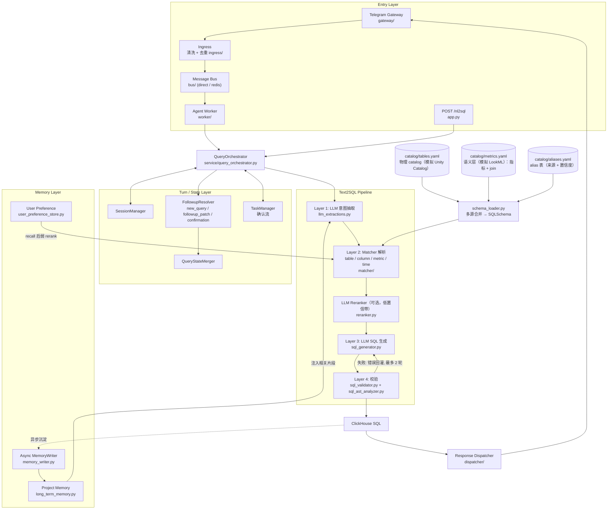

# Text2SQL Agent - 架构设计文档

## 全局约定

- **画图格式**: 所有架构图、流程图、时序图默认使用 Mermaid 格式（不使用 PlantUML）
- **详细架构**: 以 [docs/ARCHITECTURE.zh-CN.md](docs/ARCHITECTURE.zh-CN.md) 为准，本文件只保留顶层视图；Memory 设计见 [docs/MEMORY.zh-CN.md](docs/MEMORY.zh-CN.md)

## 0. 顶层分层架构

项目是 NL → ClickHouse SQL 的 text2SQL agent。路线是 **确定性解析做约束 + LLM 生成 SQL + AST 校验/修复**：
表、列、指标由 Matcher 确定性解析为规范名，LLM 只负责组装 SQL 结构（GROUP BY / JOIN / 窗口），不得发明实体名。
（早期的 DSL 生成/渲染层已移除，`/nl2dsl` 仅作为 `/nl2sql` 的兼容别名保留。）

### 架构图



### 分层说明

| 层级 | 模块 | 文件 | 职责 |
|------|------|------|------|
| **Entry** | Telegram Gateway | `gateway/telegram_gateway.py` | 渠道接入 |
| | Ingress | `ingress/*` | 渠道适配、文本清洗、去重 |
| | Bus / Worker / Dispatcher | `bus/*` `worker/*` `dispatcher/*` | 异步消息传输、消费、响应路由 |
| | HTTP API | `app.py` | 端点定义、全局实例化，委托 Orchestrator |
| | Server | `server.py` | 生命周期、schema 加载与索引构建、组件装配 |
| **Orchestration** | QueryOrchestrator | `service/query_orchestrator.py` | 串联整条查询链路 |
| **Turn / State** | Session | `service/session_manager.py` `service/session_models.py` | `last_query_state`、消息历史、JSONL 持久化 |
| | Follow-up | `service/followup_resolver.py` `service/query_state_merger.py` | 判断 turn 模式，patch 合并结构化 QueryState |
| | Task | `service/task_manager.py` | 低置信歧义的显式确认流（可跨重启恢复） |
| **Pipeline** | Layer 1 抽取 | `service/llm_extractions.py` | NL → `SQLIntentJson`（只摘录用户原话） |
| | Layer 2 解析 | `matcher/*` | `EntityMatcher`：可插拔召回（默认 IDF 倒排 + typo 探测）+ 别名打分（相似度 × 别名置信度）；`policy.py` 统一阈值/并列守卫；别名冲突暴露；主表推断；join 推断 |
| | Reranker | `service/reranker.py` | 可选，仅对已有候选做受限 LLM 终选 |
| | Layer 3 生成 | `service/sql_generator.py` | 用已解析实体组装 prompt，LLM 直出 ClickHouse SQL |
| | Layer 4 校验 | `service/sql_validator.py` `service/sql_ast_analyzer.py` | 只读、白名单、默认 LIMIT；AST 级列存在性、join 合法性、实体保真 |
| **Metadata** | Catalog | `catalog/tables.yaml` `catalog/metrics.yaml` `catalog/aliases.yaml` `matcher/schema_loader.py` | 三个文件各模拟一个元数据系统（物理 catalog / 语义层 / alias 表），各由一个 source adapter 读取后合并；启动时一次性加载 |
| **Memory** | Project / User / Writer | `memory/*` | 项目级 corrections、用户偏好弱信号、异步学习 |
| **Debug** | MCP Server | `mcp_server.py` | token / recall / rerank 调试工具 |

### 数据流

```
User (Telegram / HTTP)
    ↓
Entry (Gateway → Ingress → Bus → Worker | FastAPI)
    ↓
QueryOrchestrator ←→ Session / Task / Follow-up 状态
    ↓
Layer 1  LLM 意图抽取          ← Project Memory
    ↓
Layer 2  Matcher 确定性解析     ← SQLSchema（三源合并）/ User Preference
    ↓        （低置信 → Reranker 或确认流）
Layer 3  LLM SQL 生成（实体名固定）
    ↓
Layer 4  sqlglot 校验 + AST 分析（失败回灌修复）
    ↓
ClickHouse SQL → Dispatcher / HTTP Response
    ↓（异步）
MemoryWriter 沉淀长期记忆
```

### 关键设计约束

1. **LLM 不决定实体**：表/列/指标名只能来自 Matcher 解析结果，LLM 只组装结构
2. **不静默猜测**：低置信、分差过小、别名冲突一律走确认流或 early_exit
3. **确定性护栏独立于 LLM**：校验层不依赖模型输出质量
4. **个性化是弱信号**：优先级 `explicit input > session state > project memory > user preference`
5. **测试**：`tests/` 单元测试 + `tests/evals/nl2sql_cases.yaml` golden cases（mock LLM）；`scripts/live_eval.py` 真实 LLM 采样评测

---

# 个人笔记

> Text2SQL Agent 个人笔记，后续继续补充。
