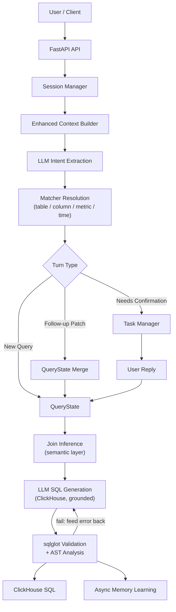

# Text2SQL Agent

[English](README.md) | [简体中文](README.zh-CN.md)

Formatted documentation: [query-agent.mintlify.app](https://query-agent.mintlify.app/)

`text2sql-agent` is a **Text2SQL Data Agent for ClickHouse**. It accepts natural language questions, extracts query intent fragments (`table / metric / column / filter / time / group_by / order / window`), resolves them to canonical schema entities with deterministic matchers, and generates validated ClickHouse SQL — with multi-turn sessions, confirmation flows for ambiguous entities, project memory, and user-preference signals.

The project is not a plain text2sql demo. It is a controlled data agent with:

- HTTP and Telegram entry points
- turn-based follow-up and confirmation handling
- Session Memory, Project Memory, and User Preference signals
- Direct and Redis message bus modes
- data-driven end-to-end eval cases

## Overview

Core query flow:

```text
Natural Language
  -> LLM Intent Extraction (Layer 1)
  -> Deterministic Entity Resolution (Layer 2: table / column / metric / time)
  -> QueryState / Turn Logic
  -> LLM SQL Generation grounded on resolved entities (Layer 3)
  -> sqlglot Validation + AST Analysis (repair loop on failure)
  -> ClickHouse SQL
```

Runtime flow:

```text
Gateway
  -> Ingress
  -> Message Bus
  -> Agent Worker
  -> Text2SQL Pipeline
  -> Dispatcher
```

## Highlights

- **Deterministic entity resolution**: tables, columns and metrics are matched against the metadata by code, with a confidence score per match — the LLM never invents entity names
- **Ask, don't guess**: uncertain or ambiguous matches go to the user as a short choice; metrics need a higher score than tables or columns, because a wrong metric means wrong numbers; missing join paths are escalated too
- **Metadata split like an enterprise**: a mock physical catalog (Unity Catalog), a mock semantic layer (LookML: metric definitions and joins) and an alias table where each alias carries its source and confidence
- **Grounded SQL generation**: the LLM writes SQL only from resolved names, join conditions and time filters; it assembles the structure
- **Validation and repair**: read-only single statement, table whitelist, default LIMIT, column/join checks, and a check that the agreed metric definitions actually appear in the SQL; failures go back to the LLM (max 2 repair rounds)
- **Optional LLM reranker** (`RERANKER_ENABLED=true`): for ambiguous matches only, it can pick a clear winner from the existing candidates and never invent new ones
- **Turn-based Q&A**: follow-ups patch the previous query state field by field (a state machine, not chat replay)
- Session persistence (JSONL append-only, restart recovery) and pending-task persistence (idempotent confirmation)
- Async memory learning: an LLM judge can write project-level correction/constraint memory back from successful queries (personal preferences stay out of project memory)
- End-to-end evaluation: 45 golden cases (mocked pytest suite + real-LLM live eval)

## Example Session

```text
Q1: Revenue by region for the last 7 days
-> SELECT users.region AS region, sum(orders.amount) AS revenue
   FROM orders JOIN users ON orders.user_id = users.id
   WHERE orders.created_at >= now() - INTERVAL 7 DAY
   GROUP BY users.region ORDER BY revenue DESC LIMIT 100

Q2: only gold members, top 3 per region
-> patch: filters += [users.vip_level = 'gold'], window = {users.region, top 3}
-> SELECT users.region AS region, sum(orders.amount) AS revenue
   FROM orders JOIN users ON orders.user_id = users.id
   WHERE users.vip_level = 'gold' AND orders.created_at >= now() - INTERVAL 7 DAY
   GROUP BY users.region ORDER BY revenue DESC LIMIT 3 BY users.region
```

Q2 inherits metric / time / grouping from Q1 — only the deltas are extracted and merged. `LIMIT 3 BY` is ClickHouse's grouped-ranking syntax.

## Key Concepts

### 1. Layered Generation

Each question goes through four steps. The LLM is used in only two of them, and it is never the one that picks names:

1. **Understand** — the LLM pulls out the phrases that matter (what to measure, how to group, which time range, which filters). It does not name any table or column.
2. **Resolve** — deterministic code maps those phrases to real tables, columns and metrics, and gives each match a confidence score. Clear matches go through. Uncertain or ambiguous ones are put to the user as a short choice instead of being guessed.
3. **Write SQL** — the LLM writes the ClickHouse query, but only from the names resolved in step 2. It decides the structure; it cannot introduce new names.
4. **Check** — deterministic code checks the SQL: read-only, only known tables and columns, joins that match the metadata, and the agreed metric definitions actually used. If a check fails, the error goes back to the LLM for a limited number of repair attempts.

How matching, thresholds and validation work in detail: [docs/ARCHITECTURE.md](docs/ARCHITECTURE.md).

### 2. Turn-Based Querying

```text
Q1: Revenue by region for the last 7 days    (new query)
Q2: Yesterday                                (patch time_range)
Q3: Change to order count                    (patch metrics)
Q4: Break it down by category                (patch group_by)
Q5: What about the products table?           (patch tables)
Q6: Top 3 per region                         (patch window)
```

Turn detection is rule-based (`followup_resolver`), state merging is field-level (`query_state_merger` with explicit/inherited provenance), and every turn is explainable via `turn_explain`.

### 3. Memory Layers

- `Session Memory` — `last_query_state / pending_task / recent turns`, JSONL persisted and restart-recoverable
- `Project Memory` — project-scoped corrections/constraints (`project_{id}/MEMORY.md`), keyword-selected and injected into the extraction prompt
- `User Preference Signal` — per `project_id + user_id` usage counts of tables/metrics/columns, used only as a weak, bounded bias on candidates before the accept/confirm decision

## Quick Start

### Requirements

- Python 3.11+
- Redis only when `MESSAGE_BUS_BACKEND=redis`

### Install

```bash
pip install -r requirements.txt
```

### Configure

Create a `.env` file in the repository root (it is git-ignored) and set at least the LLM key, e.g. `ZHIPU_API_KEY=...`.

Common environment variables:

| Variable | Required | Default | Description |
|---|---|---|---|
| `PORT` | No | `8000` | HTTP port |
| `HOST` | No | `0.0.0.0` | Bind address |
| `LOG_LEVEL` | No | `INFO` | Logging level |
| `LLM_BACKEND` | No | `zhipu` | `zhipu` or `ollama` |
| `ZHIPU_API_KEY` | Yes (zhipu) | - | Zhipu API key |
| `ZHIPU_MODEL` | No | `glm-4` | Extraction + SQL generation model |
| `TOOL_CALLING_ENABLED` | No | `true` | `false` forces prompt-based JSON output |
| `RERANKER_ENABLED` | No | `false` | `true` enables LLM cross-encoder reranking for ambiguous matches |
| `TELEGRAM_BOT_TOKEN` | No | - | Telegram gateway token |
| `MESSAGE_BUS_BACKEND` | No | `direct` | `direct` or `redis` |
| `REDIS_URL` | No | `redis://localhost:6379/0` | Redis URL |

### Run

Local direct mode:

```bash
python server.py
```

Development mode:

```bash
uvicorn server:app_with_ws --reload --port 8000
```

Redis mode:

```bash
MESSAGE_BUS_BACKEND=redis docker-compose up --build
```

### Try it

```bash
curl -X POST localhost:8000/nl2sql -H 'Content-Type: application/json' -d '{
  "text": "Revenue by region for the last 7 days",
  "project_id": 55
}'
```

Response fields include:

- `extraction_json` — Layer 1 intent fragments
- `sql` — validated ClickHouse SQL
- `resolved_intent` — the full query state used for generation
- `explain` — `resolver_explain` / `turn_explain` / `sql_generation` / timing
- `session_id`, `status`, `message`, `task_id`, `candidates`

Status values:

- `status=success`: SQL was generated and validated
- `status=early_exit`: no usable query signal (no table/metric/filter mentioned)
- `status=needs_confirmation`: low-confidence candidates require user confirmation

`POST /nl2dsl` remains as a compatibility alias. Session debug APIs: `GET /sessions`, `GET /sessions/{id}`, `DELETE /sessions/{id}`.

## Architecture Summary



For a deeper module breakdown, see [ARCHITECTURE.md](docs/ARCHITECTURE.md).

## Project Layout

```text
text2sql-agent/
├── app.py                     # FastAPI route (POST /nl2sql) + global wiring
├── server.py                  # lifecycle bootstrap + gateway/bus wiring
├── gateway/                   # Telegram gateway
├── ingress/                   # cleaning / dedup / adapter
├── bus/                       # direct / redis bus
├── worker/                    # agent worker
├── dispatcher/                # response dispatch
├── service/
│   ├── llm_extractions.py     # Layer 1: intent extraction (SQLIntentJson)
│   ├── sql_generator.py       # Layer 3: grounded SQL generation + repair loop + time exprs
│   ├── sql_validator.py       # sqlglot guardrails
│   ├── sql_ast_analyzer.py    # AST checks: columns, joins, metric fidelity, scan cost
│   ├── reranker.py            # optional constrained LLM reranker
│   ├── query_orchestrator.py  # three turn paths (new / followup / confirmation)
│   ├── session_manager.py     # session memory (JSONL persisted)
│   ├── session_models.py      # QueryState / TaskContext / SessionContext
│   ├── task_manager.py        # confirmation tasks (idempotent, persisted)
│   ├── followup_resolver.py   # rule-based turn detection
│   └── query_state_merger.py  # field-level patch merge
├── matcher/
│   ├── schema_loader.py       # source adapters (catalog / semantic layer / alias table) -> SQLSchema
│   ├── entity_matcher.py      # EntityMatcher + Retriever interface + LexicalRetriever
│   ├── policy.py              # all accept / confirm / tie / LLM-accept thresholds
│   ├── time_matcher.py        # time range parsing
│   └── matcher_service.py     # decision (resolve_with_candidates) + table/join inference
├── memory/                    # project memory / memory writer / user preferences
├── catalog/                   # demo metadata: tables.yaml / metrics.yaml / aliases.yaml (see below)
├── data/                      # session / task / memory / preference runtime data
└── tests/                     # unit + integration + data-driven e2e evals
```

## Schema Metadata & Production Notes

Metadata is split the way it is in an enterprise — each file mocks one independently maintained system and is read by its own source adapter in `matcher/schema_loader.py`, then merged into one in-memory `SQLSchema` (the matcher and AST analyzer never see files):

| File | Mocks | Contents |
|------|-------|----------|
| [catalog/tables.yaml](catalog/tables.yaml) | Physical catalog (Unity Catalog / DataHub / `INFORMATION_SCHEMA`) — machine-maintained | tables, columns, types, comments, owner, row counts, profiled distinct values of low-cardinality columns |
| [catalog/metrics.yaml](catalog/metrics.yaml) | Semantic layer (LookML) | governed metric definitions (`revenue = sum(orders.amount)`), the join graph, each view's default time dimension |
| [catalog/aliases.yaml](catalog/aliases.yaml) | Alias table | one row per `(entity_id, alias, source, confidence, status, updated_by)`; the source sets a default confidence (curated 1.0, glossary 0.9, comment 0.7, query_log / feedback 0.6, llm 0.5); `pending` rows are not indexed |

The sample is a six-table e-commerce schema (`orders / users / products / payments / reviews / sellers`). References across files are validated at load time (fail fast). Aliases are English only, so ask demo queries in English.

This demo deliberately stops at **NL → validated ClickHouse SQL**. The following production extensions are documented as the intended direction and are not implemented here:

1. **Metadata sourcing** — the three YAML files are the development/demo input. In production each source adapter is swapped for the real API client (Unity Catalog REST for tables, the LookML / dbt semantic-layer API for metrics and joins, the alias DB table fed by glossary sync, comment extraction, query-log mining, offline LLM generation with review, and confirmation feedback), synced on a schedule, then fed into `load_sql_schema()` to hot-rebuild matcher indexes. In this demo the YAML is loaded exactly once at server startup (`server.py` lifespan → `MatcherService.__init__`) and no sync scheduler exists; the planned scheduler is periodic pull → `load_sql_schema()` → rebuild `MatcherService` → `set_matcher_service()` hot swap (the swap seam is already in place).
2. **Semantic recall** — `EntityMatcher` accepts a list of `Retriever`s (`retrieve(query, k) -> (names, explain)`) and unions their candidates; scoring and the decision policy stay unchanged. The demo ships only `LexicalRetriever`. To add embedding recall in production, embed each entity's aliases + comment/description offline into a vector index, implement a `Retriever` that embeds the query and returns the top-k entity names, and pass `retrievers=[LexicalRetriever(entities), EmbeddingRetriever(...)]`. Low-confidence results still go through the confirmation flow / LLM reranker.
3. **Query execution** — running the SQL against a real ClickHouse (read-only account, statement timeout, row/cost caps, result caching) is a downstream step; the current API returns SQL only.
4. **Result rendering** — chart/table rendering of query results belongs to the presentation layer.
5. **Governance hardening** — row-level security via user-scoped predicates, per-user rate limits, PII masking, and full audit logging are natural next steps on top of the existing validator.

## Evaluation

The project uses two kinds of tests:

- unit / integration tests
- data-driven end-to-end eval cases: [tests/evals/nl2sql_cases.yaml](tests/evals/nl2sql_cases.yaml) + [tests/test_end_to_end_evals.py](tests/test_end_to_end_evals.py)

Coverage: 45 golden cases in 9 groups (single table, joins, multi-hop joins, time, filters, ambiguity, window/TopN, follow-ups, negative cases); known gaps are marked as strict xfail. See [EVALUATION.md](docs/EVALUATION.md).

The eval harness mocks LLM extraction and SQL generation but runs the real matcher service, threshold logic, state merging, confirmation flow, and persistence — golden cases pin down the deterministic core of the pipeline.

```bash
pytest -q
```

[scripts/live_eval.py](scripts/live_eval.py) replays the same cases against the real LLM to measure extraction and SQL quality, which the mocked suite cannot.

## Docs Map

- [Formatted Docs](https://query-agent.mintlify.app/): hosted Mintlify documentation
- [README.zh-CN.md](README.zh-CN.md): Chinese readme
- [ARCHITECTURE.md](docs/ARCHITECTURE.md) / [ARCHITECTURE.zh-CN.md](docs/ARCHITECTURE.zh-CN.md): architecture, module ownership, matching and validation details
- [EVALUATION.md](docs/EVALUATION.md) / [EVALUATION.zh-CN.md](docs/EVALUATION.zh-CN.md): eval harness, golden cases, and regression strategy
- [MEMORY.md](docs/MEMORY.md) / [MEMORY.zh-CN.md](docs/MEMORY.zh-CN.md): session/project/user memory design
- [TELEGRAM_TEST.md](docs/TELEGRAM_TEST.md) / [TELEGRAM_TEST.zh-CN.md](docs/TELEGRAM_TEST.zh-CN.md): Telegram testing notes
- [docs/diagrams/](docs/diagrams/): Mermaid architecture, sequence, flowchart and matcher-sequence diagrams

## Current Status

The main capabilities currently in place are:

- `NL -> validated ClickHouse SQL` pipeline (single table, joins declared in the semantic layer, grouped ranking via `LIMIT n BY`)
- turn-based query handling with structured state merging
- confirmation flow with persisted, idempotent tasks
- session/task persistence and restart recovery
- project memory injection
- user preference signal (weak bias before the accept/confirm decision)
- async memory learning
- end-to-end eval harness

Good next steps:

- richer `UserPattern / UserAlias / Preferences`
- metadata service sync for schema hot-reload
- query execution layer (read-only ClickHouse runner with cost guards)
- larger golden eval set based on real query logs
