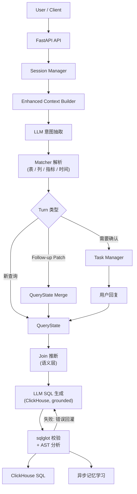

# Text2SQL Agent

[English](README.md) | [简体中文](README.zh-CN.md)

格式化文档站点：[query-agent.mintlify.app](https://query-agent.mintlify.app/)

`text2sql-agent` 是一个面向 ClickHouse 的 **Text2SQL Data Agent**。它接收自然语言问题，抽取查询意图片段（`table / metric / column / filter / time / group_by / order / window`），用确定性 matcher 把片段解析为 schema 规范实体，并生成经过校验的 ClickHouse SQL——同时支持多轮会话、歧义实体的确认流、项目记忆和用户偏好信号。

这个项目不是一个普通的 text2sql demo，而是一个受控的 Data Agent：

- 支持 HTTP 和 Telegram 两种入口
- 支持 turn-based follow-up 和 confirmation
- 支持 Session Memory、Project Memory、User Preference Signal
- 支持 Direct / Redis 两种消息总线模式
- 支持数据驱动的端到端 eval 样例集

## 总览

核心查询链路：

```text
Natural Language
  -> LLM 意图抽取 (Layer 1)
  -> 确定性实体解析 (Layer 2: 表 / 列 / 指标 / 时间)
  -> QueryState / Turn 逻辑
  -> 基于已解析实体的 LLM SQL 生成 (Layer 3)
  -> sqlglot 校验 + AST 分析（失败则修复循环）
  -> ClickHouse SQL
```

系统运行链路：

```text
Gateway
  -> Ingress
  -> Message Bus
  -> Agent Worker
  -> Text2SQL Pipeline
  -> Dispatcher
```

## 核心亮点

- **确定性实体解析**：表、列、指标由代码对照元数据匹配，每个匹配带置信分——LLM 从不发明实体名
- **问而不猜**：不确定或有歧义的匹配以简短选项交给用户；指标的采纳分数线比表和列更高，因为指标错了数字就全错；join 路径缺失同样升级确认
- **按企业分工拆分元数据**：模拟的物理 catalog（Unity Catalog）、模拟的语义层（LookML：指标口径与 join）、以及每条别名都带来源和置信度的 alias 表
- **接地（grounded）的 SQL 生成**：LLM 只能使用已解析的名称、join 条件和时间过滤来写 SQL，只负责组装结构
- **校验与修复**：单条只读语句、表白名单、默认 LIMIT、列/join 检查，并检查约定的指标口径确实出现在 SQL 中；失败时错误回灌 LLM 修复（最多 2 轮）
- **可选的 LLM 重排**（`RERANKER_ENABLED=true`）：只针对有歧义的匹配，可以从已有候选中选出明确胜者，从不发明新候选
- **Turn-based 多轮**：follow-up 按字段 patch 上一轮的查询状态（状态机，不是聊天回放）
- 会话持久化（JSONL append-only，重启恢复）与待确认任务持久化（幂等确认）
- 异步记忆学习：LLM judge 可从成功查询回写项目级纠正/约束记忆（个人偏好不进入项目记忆）
- 端到端评测：45 条 golden case（mock 版 pytest + 真实 LLM 的 live eval）

## 示例会话

```text
Q1: Revenue by region for the last 7 days
-> SELECT users.region AS region, sum(orders.amount) AS revenue
   FROM orders JOIN users ON orders.user_id = users.id
   WHERE orders.created_at >= now() - INTERVAL 7 DAY
   GROUP BY users.region ORDER BY revenue DESC LIMIT 100

Q2: only gold members, top 3 per region
-> patch: filters += [users.vip_level = 'gold'], window = {users.region, top 3}
-> SELECT users.region AS region, sum(orders.amount) AS revenue
   FROM orders JOIN users ON orders.user_id = users.id
   WHERE users.vip_level = 'gold' AND orders.created_at >= now() - INTERVAL 7 DAY
   GROUP BY users.region ORDER BY revenue DESC LIMIT 3 BY users.region
```

Q2 继承了 Q1 的指标/时间/分组——每轮只抽取和合并变化的部分。`LIMIT 3 BY` 是 ClickHouse 的分组内排名语法。

## Live Demo

在同一个 Telegram 对话里发 5 条消息：一个初始问题，三个在它基础上 patch 的 follow-up（时间、过滤、分组 top-N），
以及一个有歧义、Bot 主动询问而不是猜的问题。带截图的分步说明与运行方式见 [docs/LIVE_DEMO.zh-CN.md](docs/LIVE_DEMO.zh-CN.md)。

完整演示文稿（架构讲解 + 本 demo）见 [docs/text2sql-agent.pptx](docs/text2sql-agent.pptx)。


## 关键概念

### 1. 分层生成

每个问题经过四步。LLM 只参与其中两步，而且从不负责决定用哪张表、哪个字段：

1. **理解** — LLM 摘出问题里的关键说法（要看什么指标、按什么分组、什么时间范围、有哪些过滤条件），不给出任何表名或列名
2. **解析** — 确定性代码把这些说法对应到真实的表、列和指标，并给每个匹配打一个置信分。明确的直接采用；不确定或有歧义的，以简短选项交给用户确认，而不是猜
3. **写 SQL** — LLM 编写 ClickHouse 查询，但只能使用第 2 步解析出的名称：它决定查询结构，不能引入新名称
4. **检查** — 确定性代码检查 SQL：只读、只用已知的表和列、join 与元数据一致、确实使用了约定的指标口径。检查不通过时，错误信息交回 LLM 做有限次数的修复

匹配、阈值与校验的具体机制见 [ARCHITECTURE.zh-CN.md](docs/ARCHITECTURE.zh-CN.md)。

### 2. Turn-Based 多轮查询

```text
Q1: Revenue by region for the last 7 days    （新查询）
Q2: Yesterday                                （patch time_range）
Q3: Change to order count                    （patch metrics）
Q4: Break it down by category                （patch group_by）
Q5: What about the products table?           （patch tables）
Q6: Top 3 per region                         （patch window）
```

turn 判定是纯规则（`followup_resolver`），状态合并是字段级（`query_state_merger`，带 explicit/inherited 溯源），每轮可通过 `turn_explain` 完整解释。

### 3. 三层记忆

- `Session Memory` — `last_query_state / pending_task / recent turns`，JSONL 持久化，重启可恢复
- `Project Memory` — 项目级纠正/约束（`project_{id}/MEMORY.md`），按关键词选取注入抽取 prompt
- `User Preference Signal` — `project_id + user_id` 维度的表/指标/列使用计数，只在采纳/确认判定之前作为有上限的候选弱加权

## 快速开始

### 环境要求

- Python 3.11+
- 仅当 `MESSAGE_BUS_BACKEND=redis` 时需要 Redis

### 安装

```bash
pip install -r requirements.txt
```

### 配置

在仓库根目录创建 `.env` 文件（已被 git 忽略），至少设置 LLM 的 key，例如 `ZHIPU_API_KEY=...`。

常用环境变量：

| Variable | Required | Default | Description |
|---|---|---|---|
| `PORT` | No | `8000` | HTTP 端口 |
| `HOST` | No | `0.0.0.0` | 绑定地址 |
| `LOG_LEVEL` | No | `INFO` | 日志级别 |
| `LLM_BACKEND` | No | `zhipu` | `zhipu` 或 `ollama` |
| `ZHIPU_API_KEY` | Yes (zhipu) | - | 智谱 API key |
| `ZHIPU_MODEL` | No | `glm-4` | 抽取 + SQL 生成模型 |
| `TOOL_CALLING_ENABLED` | No | `true` | `false` 强制走 prompt-based JSON 输出 |
| `RERANKER_ENABLED` | No | `false` | `true` 开启歧义匹配的 LLM cross-encoder 重排 |
| `TRACE_IN_REPLY` | No | `false` | `true` 时在 Telegram 回复末尾附上 resolution trace（每个表 / 指标 / 列来自哪一步）；trace 始终以 INFO 级别写入日志 |
| `TELEGRAM_BOT_TOKEN` | No | - | Telegram 入口 token |
| `MESSAGE_BUS_BACKEND` | No | `direct` | `direct` 或 `redis` |
| `REDIS_URL` | No | `redis://localhost:6379/0` | Redis 地址 |

### 运行

本地 direct 模式：

```bash
python server.py
```

开发模式：

```bash
uvicorn server:app_with_ws --reload --port 8000
```

Redis 模式：

```bash
MESSAGE_BUS_BACKEND=redis docker-compose up --build
```

### 试一下

```bash
curl -X POST localhost:8000/nl2sql -H 'Content-Type: application/json' -d '{
  "text": "Revenue by region for the last 7 days",
  "project_id": 55
}'
```

响应字段：

- `extraction_json` — Layer 1 意图片段
- `sql` — 校验后的 ClickHouse SQL
- `resolved_intent` — 生成 SQL 所用的完整查询状态
- `explain` — `resolver_explain` / `turn_explain` / `sql_generation` / timing
- `session_id`、`status`、`message`、`task_id`、`candidates`

状态取值：

- `status=success`：SQL 已生成并通过校验
- `status=early_exit`：没有可用的查询信号（未提表/指标/过滤）
- `status=needs_confirmation`：低置信候选需要用户确认

`POST /nl2dsl` 保留为兼容别名。会话调试 API：`GET /sessions`、`GET /sessions/{id}`、`DELETE /sessions/{id}`。

## 架构总览



更完整的模块说明见 [ARCHITECTURE.zh-CN.md](docs/ARCHITECTURE.zh-CN.md)。

## 项目结构

```text
text2sql-agent/
├── app.py                     # FastAPI 路由（POST /nl2sql）+ 全局装配
├── server.py                  # 生命周期启动 + gateway/bus 装配
├── gateway/                   # Telegram 入口
├── ingress/                   # 清洗 / 去重 / 适配
├── bus/                       # direct / redis 总线
├── worker/                    # agent worker
├── dispatcher/                # 响应分发
├── service/
│   ├── llm_extractions.py     # Layer 1：意图抽取（SQLIntentJson）
│   ├── sql_generator.py       # Layer 3：接地 SQL 生成 + 修复循环 + 时间表达式
│   ├── sql_validator.py       # sqlglot 护栏
│   ├── sql_ast_analyzer.py    # AST 检查：列、join、指标保真、扫描成本
│   ├── reranker.py            # 可选的受限 LLM 重排
│   ├── query_orchestrator.py  # 三条 turn 路径（新查询 / follow-up / 确认）
│   ├── session_manager.py     # 会话记忆（JSONL 持久化）
│   ├── session_models.py      # QueryState / TaskContext / SessionContext
│   ├── task_manager.py        # 确认任务（幂等、持久化）
│   ├── followup_resolver.py   # 规则化 turn 判定
│   └── query_state_merger.py  # 字段级 patch 合并
├── matcher/
│   ├── schema_loader.py       # 各元数据源 adapter（catalog / 语义层 / alias 表）-> SQLSchema
│   ├── entity_matcher.py      # EntityMatcher + Retriever 接口 + LexicalRetriever
│   ├── policy.py              # 全部采纳 / 确认 / 并列 / LLM 采纳阈值
│   ├── time_matcher.py        # 时间范围解析
│   └── matcher_service.py     # 判定（resolve_with_candidates）+ 主表/join 推断
├── memory/                    # 项目记忆 / 记忆写入 / 用户偏好
├── catalog/                   # demo 元数据：tables.yaml / metrics.yaml / aliases.yaml（见下文）
├── data/                      # 会话 / 任务 / 记忆 / 偏好运行时数据
└── tests/                     # 单元 + 集成 + 数据驱动 e2e eval
```

## Schema 元数据与真实生产环境说明

元数据按企业里的真实分工拆分——每个文件模拟一个独立维护的系统，由 `matcher/schema_loader.py` 中各自的 source adapter 读取，再合并为内存中的 `SQLSchema`（matcher 与 AST analyzer 不感知文件）：

| 文件 | 模拟 | 内容 |
|------|------|------|
| [catalog/tables.yaml](catalog/tables.yaml) | 物理 catalog（Unity Catalog / DataHub / `INFORMATION_SCHEMA`），机器维护 | 表、列、类型、注释、owner、行数、低基数列的 profiling 枚举值 |
| [catalog/metrics.yaml](catalog/metrics.yaml) | 语义层（LookML） | 受治理的指标定义（`revenue = sum(orders.amount)`）、join 图、各 view 的默认时间维度 |
| [catalog/aliases.yaml](catalog/aliases.yaml) | alias 表 | 每行 `(entity_id, alias, source, confidence, status, updated_by)`；source 决定默认置信度（curated 1.0、glossary 0.9、comment 0.7、query_log / feedback 0.6、llm 0.5）；`pending` 行不进索引 |

样例为 6 张表的电商 schema（`orders / users / products / payments / reviews / sellers`），跨文件引用在加载时校验（fail fast）。别名只有英文，demo 查询需要用英文提问。

本 Demo 刻意止步于 **NL → 校验后的 ClickHouse SQL**。以下生产扩展是文档化的方向，不在本 Demo 实现范围内：

1. **元数据来源** — 三个 YAML 是开发/演示态输入。生产态把各 source adapter 换成真实 API 客户端（表走 Unity Catalog REST，指标与 join 走 LookML / dbt 语义层 API，alias 表由 glossary 同步、注释抽取、query log 挖掘、LLM 离线生成 + 人工审核、确认流反馈共同写入），定时同步后喂给 `load_sql_schema()` 热重建 matcher 索引。当前 demo 只在 server 启动时加载一次 YAML（`server.py` lifespan → `MatcherService.__init__`），没有同步调度器；规划中的调度器为定时拉取 → `load_sql_schema()` → 重建 `MatcherService` → `set_matcher_service()` 热替换（热替换接缝已就绪）
2. **语义召回** — `EntityMatcher` 接受一组 `Retriever`（`retrieve(query, k) -> (names, explain)`），候选取并集，打分与判定策略不变。Demo 只带 `LexicalRetriever`。生产接入 embedding：离线把每个实体的别名 + 注释/描述向量化建索引，实现一个对 query 做 embedding 并返回 top-k 实体名的 `Retriever`，以 `retrievers=[LexicalRetriever(entities), EmbeddingRetriever(...)]` 传入；低置信结果照旧走确认流 / LLM reranker
3. **查询执行** — 对真实 ClickHouse 执行 SQL（只读账号、语句超时、行数/成本上限、结果缓存）是下游步骤；当前 API 只返回 SQL
4. **结果渲染** — 查询结果的图表/表格渲染属于展示层
5. **治理加固** — 基于 user-scoped 谓词的行级安全、按用户限流、PII 脱敏、完整审计日志，是现有校验器之上的自然下一步

## 评测

两类测试：

- 单元 / 集成测试
- 数据驱动的端到端 eval：[tests/evals/nl2sql_cases.yaml](tests/evals/nl2sql_cases.yaml) + [tests/test_end_to_end_evals.py](tests/test_end_to_end_evals.py)

覆盖：45 条 golden case、9 组（单表、join、多跳 join、时间、过滤、歧义、window/TopN、follow-up、负例），已知缺口用 strict xfail 标记。详见 [EVALUATION.zh-CN.md](docs/EVALUATION.zh-CN.md)。

eval harness mock 了 LLM 抽取与 SQL 生成，但跑真实的 matcher 服务、阈值逻辑、状态合并、确认流和持久化——golden case 锁定管道的确定性内核。

```bash
pytest -q
```

[scripts/live_eval.py](scripts/live_eval.py) 用真实 LLM 重放同一批 case，度量 mock 测不到的抽取与 SQL 质量。

## 文档索引

- [格式化文档站点](https://query-agent.mintlify.app/)：Mintlify 托管文档
- [README.md](README.md)：英文 readme
- [ARCHITECTURE.md](docs/ARCHITECTURE.md) / [ARCHITECTURE.zh-CN.md](docs/ARCHITECTURE.zh-CN.md)：架构、模块职责、匹配与校验细节
- [EVALUATION.md](docs/EVALUATION.md) / [EVALUATION.zh-CN.md](docs/EVALUATION.zh-CN.md)：eval harness、golden case 与回归策略
- [MEMORY.md](docs/MEMORY.md) / [MEMORY.zh-CN.md](docs/MEMORY.zh-CN.md)：会话/项目/用户记忆设计
- [LIVE_DEMO.md](docs/LIVE_DEMO.md) / [LIVE_DEMO.zh-CN.md](docs/LIVE_DEMO.zh-CN.md)：Telegram live demo 分步说明、运行方式与常见问题
- [docs/diagrams/](docs/diagrams/)：Mermaid 架构图、时序图、流程图与 matcher 时序图

## 当前状态

主线能力：

- `NL -> 校验后 ClickHouse SQL` 管道（单表、语义层声明的 join、`LIMIT n BY` 分组排名）
- 结构化状态合并的 turn-based 多轮
- 持久化、幂等的确认流
- 会话/任务持久化与重启恢复
- 项目记忆注入
- 用户偏好信号（采纳/确认判定前的弱加权）
- 异步记忆学习
- 端到端 eval harness

下一步方向：

- 更丰富的 `UserPattern / UserAlias / Preferences`
- 元数据服务同步 + schema 热更新
- 查询执行层（带成本护栏的只读 ClickHouse runner）
- 基于真实 query log 扩大 golden eval 集
