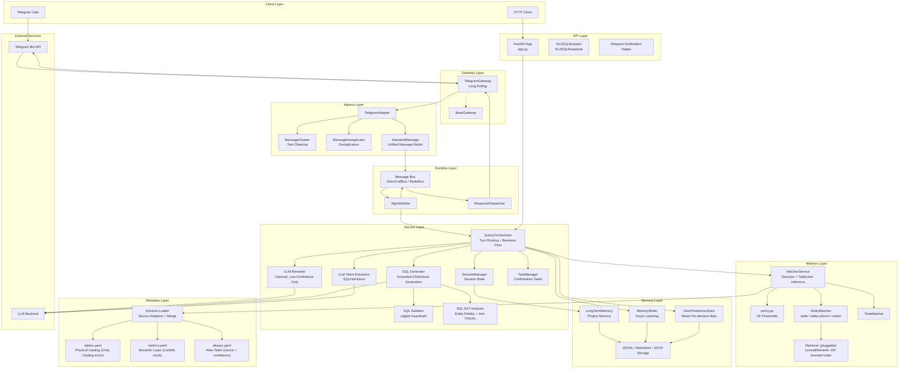
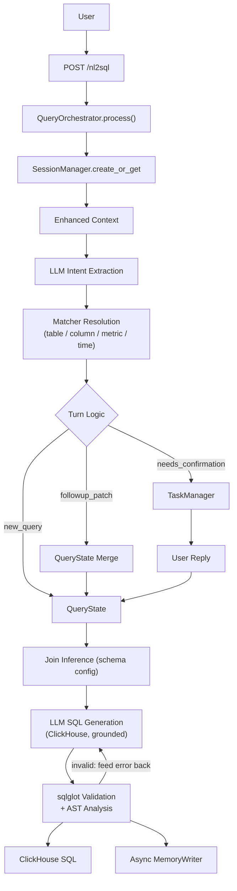
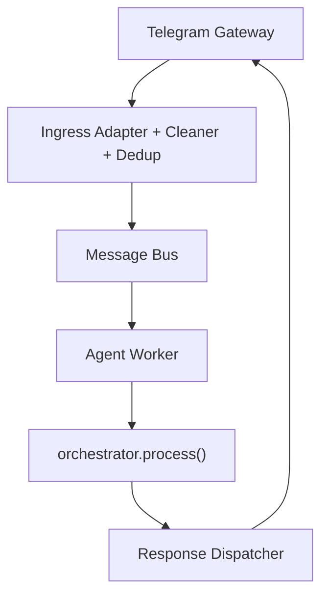

[Chinese version](https://github.com/frankzh0330/text2sql-agent/blob/master/docs/ARCHITECTURE.zh-CN.md)

This document summarizes the current architecture of `text2sql-agent`, the responsibility of each major module, and the intended dependency direction between layers.

It is the overview page of the **How It Works** group: each area has a dedicated deep-dive page — [Extraction & Resolution](/MATCHER) (Layers 1–2), [Generation & Validation](/SQL_PIPELINE) (Layers 3–4), [Multi-Turn & Confirmation](/MULTI_TURN) and [Memory](/MEMORY). What changes for production is on [Demo vs Production](/PRODUCTION), and planned features on the [Roadmap](/ROADMAP).

## Layered View

The system is organized as layers with a strict division of labor: gateways and ingress adapt channels into one unified message model, the runtime layer carries it to the worker, `QueryOrchestrator` routes a single turn through the text2sql pipeline with the turn/state components, and the matcher resolves names against a declared three-source metadata layer. Dependencies point downward only (next section).



## Dependency Direction

Core rule: dependencies flow downward.

```text
server.py
  ├─ gateway/*
  ├─ bus/*
  ├─ worker/*
  ├─ dispatcher/*
  └─ app.py
       └─ service/query_orchestrator.py
            ├─ service/session_manager.py
            ├─ service/task_manager.py
            ├─ service/followup_resolver.py
            ├─ service/query_state_merger.py
            ├─ service/llm_extractions.py
            ├─ matcher/*
            ├─ service/sql_generator.py
            ├─ service/sql_validator.py
            └─ memory/*
```

Guidelines:

- `app.py` owns endpoint definitions and global wiring; business logic delegates to `QueryOrchestrator`.
- `server.py` owns startup wiring and lifecycle, not query semantics.
- `matcher/*` should stay focused on matching/retrieval, not session policy.
- `memory/*` should provide reusable signal/knowledge layers, not FastAPI behavior.

## Top-Level Runtime

### HTTP Path



### Telegram / Bus Path



### End-to-End Flow

Both paths meet in the same orchestrator — the channel only changes how the query arrives and how the answer leaves. The full journey of one query, including the ingress guards (duplicates and empty texts are dropped before the bus ever sees them), the three turn modes, the confirmation branch with its optional LLM rerank, and the validation repair loop:

```mermaid
flowchart TD
    Start(("User sends query")) --> Channel{"Channel?"}

    Channel -->|Telegram| Poll["TelegramGateway<br/>Long polling"]
    Poll --> Adapt["TelegramAdapter<br/>Convert to StandardMessage"]
    Adapt --> Clean["MessageCleaner<br/>Clean text"]
    Clean --> Dup{"Duplicate?"}
    Dup -->|Yes| DropDup(("Discard"))
    Dup -->|No| Empty{"Empty after cleaning?"}
    Empty -->|Yes| DropEmpty(("Discard"))
    Empty -->|No| Bus["Message Bus<br/>DirectCallBus / RedisBus"]
    Bus --> Worker["AgentWorker"]
    Worker --> Session

    Channel -->|HTTP| HTTP["FastAPI POST /nl2sql"]
    HTTP --> Session

    Session["SessionManager<br/>create_or_get"]
    Session --> Context["Enhanced Context<br/>Session + Project Memory"]
    Context --> Extract

    subgraph Extract["Layer 1: LLM Intent Extraction"]
        Prompt["Build context-aware prompt"]
        LLM["Call LLM"]
        Parsed["Parse SQLIntentJson"]
        Prompt --> LLM --> Parsed
    end

    Parsed --> Followup["Follow-up Detection"]
    Followup --> Turn{"Turn mode?"}
    Turn -->|new_query| Resolve
    Turn -->|followup_patch| Patch["Extract patch"]
    Patch --> Merge["Merge with last_query_state"]
    Merge --> Resolve
    Turn -->|confirmation| Confirm["Restore pending task"]
    Confirm --> Resolve

    subgraph Resolve["Layer 2: Matcher Resolution"]
        Cands["EntityMatcher candidates<br/>table / metric / column"]
        Bias["User preference bias"]
        Decide["Decide (matcher/policy.py)<br/>accept / confirm / no_match"]
        Time["TimeMatcher"]
        Infer["Table inference +<br/>join inference"]
        Cands --> Bias --> Decide --> Time --> Infer
    end

    Infer --> Ambiguous{"Needs confirmation?"}
    Ambiguous -->|Yes| Rerank["Optional LLM rerank<br/>(may auto-accept)"]
    Rerank -->|auto-accepted| GenSQL
    Rerank -->|still ambiguous| Task["Create TaskContext<br/>Return candidates"]
    Task --> EndConfirm(("Wait for user reply"))
    Ambiguous -->|No| GenSQL

    subgraph GenSQL["Layer 3-4: SQL Generation And Validation"]
        Intent["Assemble grounded intent<br/>tables / metric exprs / joins / time expr"]
        Generate["LLM generates ClickHouse SQL"]
        Validate["sqlglot validate<br/>readonly / whitelist / auto LIMIT"]
        Analyze["AST analysis<br/>columns / joins / entity fidelity"]
        Repair["Repair loop with error feedback"]
        Intent --> Generate --> Validate --> Analyze
        Validate -->|invalid| Repair --> Generate
        Analyze -->|errors| Repair
    end

    Analyze --> Persist["Persist session state<br/>Record preferences"]
    Persist --> Learn["Async MemoryWriter"]
    Persist --> Caller{"Caller?"}
    Caller -->|Telegram| Format["ResponseDispatcher<br/>Format SQL + intent"]
    Format --> Send["Send Telegram response"]
    Send --> EndTG(("End"))
    Caller -->|HTTP| Return["Return NL2SQLResponse"]
    Return --> EndHTTP(("End"))
```



## The pipeline at a glance

One query flows through four stages; each stage has a contract, its own page, and deterministic guardrails around the two LLM calls:

- **Layer 1 — LLM extraction** copies phrases (metric · dimension · time · filter) out of the question into a structured `SQLIntentJson` — no SQL, no invented names. See [Extraction & Resolution](/MATCHER).
- **Layer 2 — matcher resolution** turns those phrases into canonical table / column / metric / time names with scores, thresholds and explicit confirmation on ambiguity. This is the heart of the system — see [Extraction & Resolution](/MATCHER).
- **Layer 3 — SQL generation** pins tables, metric expressions, joins and the time predicate in the prompt; the LLM composes structure only. See [Generation & Validation](/SQL_PIPELINE).
- **Layer 4 — validation** runs deterministic sqlglot + AST guardrails (read-only, whitelist, join graph, entity fidelity, `LIMIT n BY`) and feeds failures back for at most two repair rounds. See [Generation & Validation](/SQL_PIPELINE).

## Multi-turn and memory at a glance

Every turn is state-driven, not prompt-driven: `last_query_state` is created, patched or confirmed through three turn modes (`new_query` / `followup_patch` / `confirmation`), and low-confidence ambiguity becomes an explicit confirmation task that survives process restarts. See [Multi-Turn & Confirmation](/MULTI_TURN).

Three memory layers feed weak signals in — session state, project memory (corrections and constraints injected into extraction), and a bounded user-preference bias applied before the accept/confirm decision. See [Memory](/MEMORY).

Evaluation runs on mocked end-to-end golden cases plus a live-LLM sampling harness; known gaps are pinned as strict xfail. See [Evaluation Strategy](/EVALUATION).

## System Components

### `app.py`

Responsibilities:

- request/response models
- global service instantiation (SessionManager, TaskManager, QueryOrchestrator)
- endpoint definitions (delegates to QueryOrchestrator)
- Telegram notification helper

### `server.py`

Responsibilities:

- application lifespan
- matcher service initialization (schema loading + index build)
- bus / worker / dispatcher wiring
- Telegram gateway startup
- session periodic cleanup (5 min interval, 60 min expiry)

### `gateway/*`, `ingress/*`, `bus/*`, `worker/*`, `dispatcher/*`

Responsibilities:

- channel adaptation
- message cleaning and dedup
- async request transport
- worker consumption
- response routing

These components let the agent run as more than a plain HTTP API.
