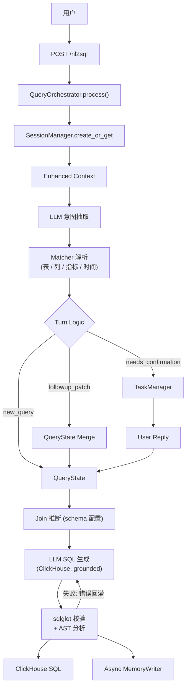
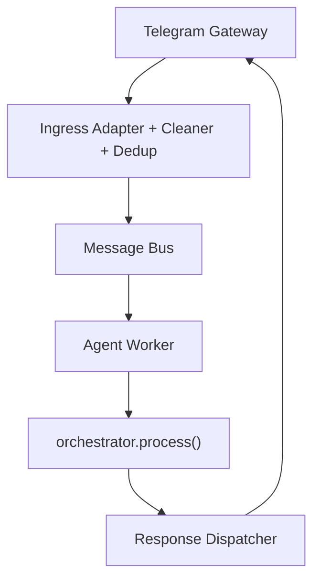
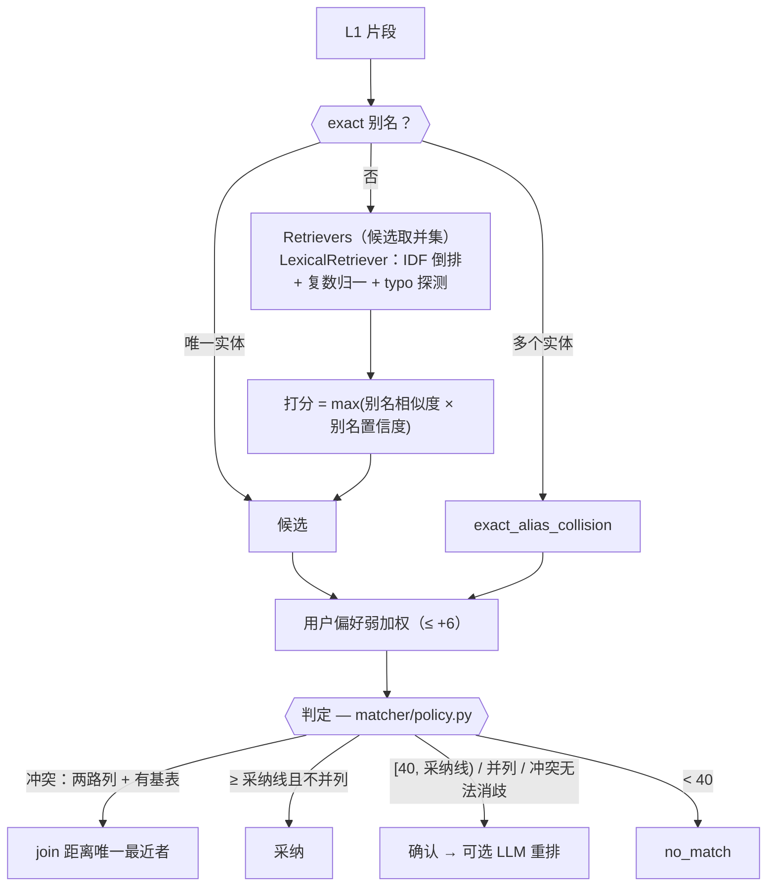
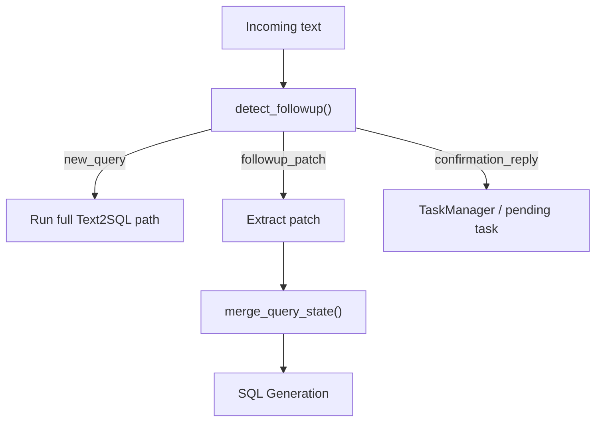
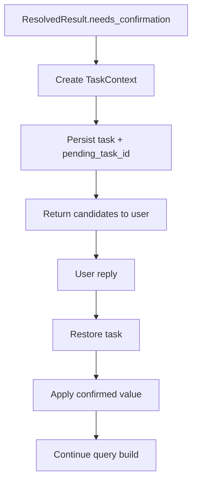

# 架构总览

[English](ARCHITECTURE.md) | [简体中文](ARCHITECTURE.zh-CN.md)

本文总结 `text2sql-agent` 当前的真实架构、各主要模块的职责，以及层间依赖方向。

## 分层视图

```text
┌──────────────────────────────────────────────────────────────┐
│                        Gateway Layer                        │
│   TelegramGateway · HTTP Client / FastAPI Entry            │
├──────────────────────────────────────────────────────────────┤
│                          API Layer                          │
│   app.py                                                    │
│   端点定义 · 全局服务实例化 · 委托 QueryOrchestrator        │
├──────────────────────────────────────────────────────────────┤
│                       Turn / State Layer                    │
│   session_manager.py · session_models.py                    │
│   task_manager.py · followup_resolver.py                    │
│   query_state_merger.py                                     │
├──────────────────────────────────────────────────────────────┤
│                      Text2SQL Pipeline                      │
│   llm_extractions.py                                        │
│   matcher_service.py + entity_matcher.py + policy.py        │
│   reranker.py（可选）                                       │
│   sql_generator.py · sql_validator.py · sql_ast_analyzer.py │
├──────────────────────────────────────────────────────────────┤
│                        Memory Layer                         │
│   long_term_memory.py · memory_writer.py                    │
│   user_preference_store.py                                  │
├──────────────────────────────────────────────────────────────┤
│                    Runtime / System Layer                   │
│   bus/* · worker/* · dispatcher/* · server.py               │
└──────────────────────────────────────────────────────────────┘
```

## 依赖方向

核心规则：依赖应当自上而下流动。

```text
server.py
  ├─ gateway/*
  ├─ bus/*
  ├─ worker/*
  ├─ dispatcher/*
  └─ app.py
       └─ service/query_orchestrator.py
            ├─ service/session_manager.py
            ├─ service/task_manager.py
            ├─ service/followup_resolver.py
            ├─ service/query_state_merger.py
            ├─ service/llm_extractions.py
            ├─ matcher/*
            ├─ service/sql_generator.py
            ├─ service/sql_validator.py
            └─ memory/*
```

设计约束：

- `app.py` 只负责端点定义和全局实例化，业务逻辑委托给 `QueryOrchestrator`
- `server.py` 负责启动 wiring 和生命周期，不负责查询语义
- `matcher/*` 聚焦匹配与召回，不掺入 session 策略
- `memory/*` 提供可复用知识层和偏好信号，不直接耦合 FastAPI 行为

## 顶层运行链路

### HTTP 路径



### Telegram / Bus 路径



## Text2SQL Pipeline

### Layer 1：LLM Extraction

主要文件：[service/llm_extractions.py](../service/llm_extractions.py)

职责：

- 把自然语言转成结构化 extraction
- 注入 session context 和选出的 project memory
- 在 follow-up 场景下尽量提取 patch，而不是重建全量状态

输入：

- `text`
- recent session context
- `last_query_state`
- selected `memory_corrections`

输出：

- `SQLIntentJson`（table / metric / column / filter / group_by / time / order / window 片段）

### Layer 2：Matcher Resolution

主要文件：[matcher/matcher_service.py](../matcher/matcher_service.py)（判定 + 主表/join 推断）、
[matcher/entity_matcher.py](../matcher/entity_matcher.py)（表/列/指标共用的 `EntityMatcher`）、
[matcher/policy.py](../matcher/policy.py)（全部阈值）、[time_matcher.py](../matcher/time_matcher.py)，
元数据来自 [matcher/schema_loader.py](../matcher/schema_loader.py) 合并后的 `SQLSchema`。



职责：

- 解析 `table / table.column / metric_id / time_range`，带分数与候选
- 候选生成（`EntityMatcher`）：query 与别名都先做单复数折叠（`product categories` ≡ `product category`，`-ies` → `-y`，`-ss/-us/-is` 不动），在折叠后的 key 上做 exact 与打分；exact 别名命中直接短路；否则每个 `Retriever` 召回 top-k 实体名，取并集后打分。默认 `LexicalRetriever` 为 IDF 加权（BM25-lite），判别性 token 胜过泛化 token（table/amount/id），召回 token 同样做复数归一（`customers` -> `customer`），零命中且 ≥4 字符的 token 做 edit-distance-1 词表探测（'orde tablez' -> orders），权重 0.75 折
- 打分：`max(别名相似度 × 别名置信度)`，置信度来自别名来源（curated 1.0 … llm 0.5）。只有 query 不短于别名时才允许 WRatio 子串匹配，短 query 不能靠长别名的前缀胜出（`customer` 对 `customer reviews` 得 67 分，对 `customers` 得 94 分）
- 唯一的判定函数（`resolve_with_candidates`），固定顺序：偏好加权 → 冲突处理 → 分档，阈值全部在 `matcher/policy.py`：metric ≥ 90 直接用（指标错则数字全错），table/column ≥ 80；[40, 采纳线) 触发用户确认，< 40 视为无匹配；并列守卫在 top1/top2 分差 <10 时即使过线也进确认
- exact 别名冲突（同一别名挂多个实体，如 amount 在 orders/payments、time 在三张表）查询时暴露、绝不静默 first-wins：两路列冲突且有基表上下文时按 join 图距离确定性消歧（orders 语境下 region -> users.region）；3 路超泛化词或距离并列升级确认流并给出全部候选
- 列（group-by / 明细 / window 分组）遵守同一判定：需确认的列升级确认流，不再静默取召回 top1
- 用户不提表名时推断主表（从指标表达式或列归属投票）
- 从语义层声明的 join 图推断 join 步骤；路径缺失升级为确认流

重要细节：

- user preference 是有上限的候选弱加权，在采纳/确认判定**之前**生效；可打破并列或调整候选顺序，改变 top1 时 `method` 标注 `+user_bias`
- 可选的受限 LLM 重排（[service/reranker.py](../service/reranker.py)，`RERANKER_ENABLED=true`）只在判定落入确认带时触发：只能对已有候选重排、不得发明新值，明确胜出（relevance ≥ 85 且 margin ≥ 15）才静默采纳；生产可在同一接口后换成本地 cross-encoder 模型（如 bge-reranker-v2-m3）
- matcher 本身仍然是主要语义解析器
- 召回可插拔：加 embedding `Retriever` 不需要改打分和判定策略（见 [Schema 与 Metadata](#schema-与-metadata)）

### Layer 3：SQL Generation

主要文件：[service/sql_generator.py](../service/sql_generator.py)

职责：

- 用已解析实体组装生成 prompt：主表、指标表达式、限定列、过滤条件、
  ClickHouse 时间谓词、join 条件、window/order 意图
- window 意图兜底：L1 截断窗口短语时（如只抽到 "in each region"，"top 3" 留在原句），
  用完整查询文本重试解析，确定性找回 limit 与分组（explain 记录 `recovered_from_full_text`）
- LLM 只组装结构（GROUP BY / JOIN / `LIMIT n BY` 分组排名），实体名由 prompt 固定
- 修复循环：校验失败的错误信息回灌下一轮（最多额外 2 轮）

### Layer 4：Validation

主要文件：[service/sql_validator.py](../service/sql_validator.py)（sqlglot，`dialect="clickhouse"`）和
[service/sql_ast_analyzer.py](../service/sql_ast_analyzer.py)

职责：

- 单条只读语句（仅 SELECT / WITH）
- 所有表引用必须在 schema 白名单内
- 默认 LIMIT 注入
- AST 分析：列存在性（sqlglot 别名解析后）、join 边与 ON 键必须与语义层声明的 join 图一致、JOIN 缺 ON 报错
- 实体保真（对抗语义漂移）：已解析的表、指标表达式、过滤谓词必须出现在 SQL 中
- 静态成本警告（按 catalog 行数估算扫描量、事实表无条件全表扫描、join 深度），只写入 explain（`explain.resolver_explain.sql_generation.ast_analysis`）
- 分析错误与校验错误一样回灌修复循环；警告不阻断
- 确定性护栏，独立于 LLM

## Turn-Based Querying

Turn-based 行为是系统的一等公民，不是简单的 prompt 技巧。

### 核心模块

- [service/session_models.py](../service/session_models.py)
  - `QueryState`
  - `SessionContext`
  - `TaskContext`
- [service/followup_resolver.py](../service/followup_resolver.py)
- [service/query_state_merger.py](../service/query_state_merger.py)
- [service/task_manager.py](../service/task_manager.py)

### Turn 模式

系统区分：

- `new_query`
- `followup_patch`
- `confirmation`

### Follow-Up 流程



### 为什么重要

它能支持这类多轮查询：

```text
Q1: Revenue by region for the last 7 days
Q2: Yesterday
Q3: Change it to order count
Q4: Break it down by category
Q5: Only gold members
Q6: Top 3 per region
```

而不要求用户每轮都把所有字段重说一遍。（demo schema 只有英文别名，示例查询均用英文。）

## Memory 架构

当前项目实际上已经形成了三层 memory。

### 1. Session Memory

主要文件：

- [service/session_manager.py](../service/session_manager.py)
- [service/session_models.py](../service/session_models.py)

存储内容：

- `last_query_state`
- `pending_task_id`
- recent messages
- turn metadata

作用：

- follow-up patch
- confirmation continuation
- session restart recovery

### 2. Project Memory

主要文件：[memory/long_term_memory.py](../memory/long_term_memory.py)

存储内容：

- 项目级 corrections
- 业务约束
- 默认映射
- 领域 caveats

重要细节：

- memory 从 `project_{id}/MEMORY.md` 加载
- 列表型文件（如 `auto_learned.md`）按条目拆分，每轮按当前 query 关键词重新选择相关条目
- 不再需要每轮都注入整份项目 memory

### 3. User Preference Signal

主要文件：[memory/user_preference_store.py](../memory/user_preference_store.py)

存储内容：

- 用户级 `table / metric / column` 使用计数
- 作用域严格限制为 `project_id + user_id`

作用：

- 在 recall 之后、采纳/确认判定之前对候选做有上限的弱加权（≤ +6）
- 阈值只看召回原始分：偏好只能在都过线的候选间打破并列，不能把低置信候选推成静默采纳
- 绝不替代 matcher 主语义判断
- 保持为弱信号，而不是主解析器

## Confirmation Flow

低置信度歧义通过显式确认处理，而不是 silent guessing。

### Confirmation 生命周期



### 持久化

Session 和 Task 分开持久化：

- session：JSONL append-only session log
- task：JSONL append-only task log
- JSONL compaction：超过 500 行自动压缩，保留 100 条 + 最新 state/meta

这样可以支持：

- 进程重启恢复
- 聊天渠道里的延迟确认
- 长期运行不撑爆磁盘

## Async Memory Learning

主要文件：[memory/memory_writer.py](../memory/memory_writer.py)

职责：

- 异步判断某次成功查询是否值得沉淀为长期记忆
- 将学习结果追加到项目级 memory 文件（只写 `correction` / `constraint`；个人偏好不进 project memory）
- 自动维护 `MEMORY.md` 索引

它是一个 sidecar 行为：

- 非阻塞
- 容错
- 不影响主查询路径

## 系统组件

### `app.py`

职责：

- request/response models
- 全局服务实例化（SessionManager、TaskManager、QueryOrchestrator）
- 端点定义（委托给 QueryOrchestrator）
- Telegram 通知辅助

### `server.py`

职责：

- 应用生命周期
- matcher service 初始化（schema 加载 + 索引构建）
- bus / worker / dispatcher 装配
- Telegram gateway 启动
- session 定时清理（5 分钟间隔，60 分钟过期）

### `gateway/*`, `ingress/*`, `bus/*`, `worker/*`, `dispatcher/*`

职责：

- 渠道适配
- 文本清洗与去重
- 异步请求传输
- worker 消费
- 响应路由

这些组件让系统不只是一个 HTTP API，而是可以作为消息驱动 agent 运行。

## 架构场景示例

下面这些场景适合用来从端到端角度验证架构是否闭环。它们更偏行为说明，
不是单个函数的 unit test。

### 场景 1：首次查询

```json
POST /nl2sql
{
  "text": "Revenue by region for the last 7 days",
  "project_id": 55
}
```

预期行为：

- 创建或恢复 session
- 走完整 `new_query` 路径
- 解析 metric / time / 分组列，从指标推断主表（`revenue -> orders`），
  并为 `users.region` 推断 join
- 生成并校验 ClickHouse SQL
- 返回 `status=success`
- 持久化 `last_query_state`，供后续 turn 使用

### 场景 2：Follow-Up Patch

```json
POST /nl2sql
{
  "text": "Change to order count",
  "project_id": 55,
  "session_id": "abc-123"
}
```

预期行为：

- 识别为 `followup_patch`
- 继承 tables、time 等未显式修改字段
- 只 patch metrics 字段
- 在 `field_sources` 中标记字段来源是 `explicit` 还是 `inherited`

### 场景 3：纯时间 Follow-Up

```text
Q1: Revenue by region for the last 7 days
Q2: Yesterday
```

预期行为：

- 保持 `tables=[orders]`
- 保持 `metrics=[revenue]`
- 保持上一轮分组
- 只修改 time range

这也是为什么 `last_query_state` 必须是结构化状态，而不能只是普通聊天摘要。

### 场景 4：确认流

```json
POST /nl2sql
{
  "text": "Show revenue for the product table",
  "project_id": 55
}
```

如果表解析存在歧义，系统应返回：

```json
{
  "status": "needs_confirmation",
  "task_id": "xxx",
  "candidates": {
    "tables": [
      { "value": "products", "score": 55.0 },
      { "value": "orders", "score": 48.0 }
    ]
  }
}
```

随后用户回复：

```json
POST /nl2sql
{
  "text": "1",
  "session_id": "abc-123"
}
```

系统应恢复 pending task，应用用户确认的候选值，继续生成 SQL，并清理
`pending_task_id`。

### 场景 5：Project Memory 注入

```text
Project memory:
In this project, "big orders" means orders with amount greater than 1000.

User query:
Show me big orders
```

预期行为：

- 只加载 `_global` 和 `project_55` 作用域的 memory
- 选择与当前 query 相关的 project memory 片段
- 在 LLM extraction 前注入这些片段
- 将项目规则和用户偏好明确区分

### 场景 6：User Preference Rerank

```text
User history:
user_a 在 project_55 中经常使用 order_count。

Current query:
一个低置信的 sales 查询（候选 revenue/order_count 分数接近）。
```

预期行为：

- matcher recall 仍然先产生候选集
- user preference 在 recall 之后、判定之前生效
- preference 可以轻微提升 `order_count`
- preference 不能覆盖更强的显式语义匹配

### 场景 7：重启恢复

```text
Turn 1: 模糊查询返回 needs_confirmation
Process restarts
Turn 2: 用户回复 "1"
```

预期行为：

- session storage 恢复 `pending_task_id`
- task storage 恢复未完成的确认任务
- 用户确认回复继续完成查询，而不是被当作新的独立查询

## Validation 与 Debugging

系统当前暴露了比较丰富的 explain / debug 信息：

- `resolver_explain`
- `turn_explain`
- candidate scores
- follow-up decision signals
- patch fields
- confirmed fields
- 各层 timing

这很重要，因为项目已经更像 agent，而不是一次性翻译器。

## Evaluation 策略

项目同时使用常规测试和数据驱动 end-to-end eval。

### End-to-End Eval Harness

主要文件：

- [tests/evals/nl2sql_cases.yaml](../tests/evals/nl2sql_cases.yaml)
- [tests/test_end_to_end_evals.py](../tests/test_end_to_end_evals.py)

当前覆盖：45 条用例、9 组（单表、join、多跳 join、时间表达式、过滤、歧义、window/TopN、follow-up、负例）。
用例清单和 strict xfail 已知缺口见 [EVALUATION.zh-CN.md](EVALUATION.zh-CN.md)。

这套 harness 更接近“golden cases”，而不是单纯 unit test。

pytest harness 对 LLM 抽取和 SQL 生成做了 mock，评测的是 matcher 解析、状态合并、确认流以及传给 SQL 生成的入参，离线几秒即可跑完。
带 `xfail` 的 case 断言的是已知局限下的*正确行为*（strict，一旦修复会强制去掉标记）。

### Live LLM Eval

[scripts/live_eval.py](../scripts/live_eval.py) 用真实 LLM 重放同一批 case，输出每条 case 的通过情况、SQL 静态校验结果、
解析出的指标表达式是否出现在 SQL 中，以及延迟。它测的是 mock 版测不到的部分（抽取和 SQL 质量）。
LLM 输出每次会有波动，所以结果只是一次采样，不是稳定的准确率；"SQL 有效"也不等于"SQL 正确"。

## Schema 与 Metadata

元数据按企业里的真实分工拆分：仓库里每个文件模拟一个独立维护的系统，由
[matcher/schema_loader.py](../matcher/schema_loader.py) 中各自的 source adapter 读取，合并为内存中的
`SQLSchema`，跨文件引用在加载时校验（fail fast）。

| 文件 | 模拟 | 内容 |
|------|------|------|
| [catalog/tables.yaml](../catalog/tables.yaml) | 物理 catalog（Unity Catalog / DataHub / OpenMetadata / `INFORMATION_SCHEMA`），机器维护 | 表、列、类型、注释、owner、行数、低基数列的 profiling 枚举值 |
| [catalog/metrics.yaml](../catalog/metrics.yaml) | 语义层（LookML） | 受治理的指标定义、join 图、各 view 的默认时间维度 |
| [catalog/aliases.yaml](../catalog/aliases.yaml) | alias 表 | `(entity_id, alias, source, confidence, status, updated_by)` 行 |

别名来源与默认置信度（单行可覆盖）：

| 来源 | 置信度 | 说明 |
|------|--------|------|
| curated | 1.0 | 人工维护、git review（核心指标和口径） |
| glossary | 0.9 | catalog business glossary 术语绑定到列或指标 |
| comment | 0.7 | 从 catalog 列注释派生 |
| query_log | 0.6 | 从历史 SQL + 工单/问题文本挖掘 |
| feedback | 0.6 | 确认流里用户的选择，累积后升级 |
| llm | 0.5 | 根据名称、注释、样例值离线生成，初始为 `pending` |

`pending` 行审核前不进索引。每个实体的规范名总是置信度 1.0 的别名。置信度与匹配分相乘，所以命中
0.6 置信度的别名即使 exact 也只有 60 分，走确认流而不是自动采纳。demo 别名只有英文，demo 查询需要用英文提问。

更接近生产的方向是：

- 各 source adapter 换成真实客户端（表走 Unity Catalog REST，指标与 join 走 LookML / dbt 语义层 API，
  别名走 alias DB 表），定时同步
- 同步后调用 `load_sql_schema()` 热重建 matcher 索引
- 当前未实现同步调度器：demo 态 catalog 在 server 启动时一次性加载（`server.py` lifespan），
  更新 YAML 需重启进程；热重建接缝已就绪（`load_sql_schema()` → 重建 `MatcherService` →
  `set_matcher_service()` 热替换）
- 语义召回：`EntityMatcher(entities, retrievers=[...])` 对所有 `Retriever`
  （`retrieve(query, k) -> (names, explain)`）的候选取并集，打分与判定策略不变。接入 embedding 召回：
  离线把每个实体的别名 + 注释/描述向量化建索引，实现一个对 query 做 embedding 并返回 top-k 实体名的
  `Retriever`，与 `LexicalRetriever` 一起传入
- 查询执行（只读账号、超时、成本上限）与结果渲染属于下游层，不在本 Demo 范围

这一点重要，因为真实环境可能会有：

- 数万级表和列
- 每个列多个业务别名
- 强项目语义和业务约束

## 过滤值解析

像 "paid by credit card" 这样的过滤条件要解析两部分：**列**（`payments.payment_type`）和**值**（`credit_card`）。
LLM 只负责摘录用户原话，所以抽出来的值（`credit card`）和库里存的值往往不一致。
这一步出错会得到"能通过静态校验，但查不到数据或查错数据"的 SQL，真实 LLM eval 里就暴露过（见 [Evaluation 策略](#evaluation-策略)）。

### 本项目当前做法

- **列**：[orchestrator](../service/query_orchestrator.py) 只接受高置信匹配（score >= 80）的过滤列。低置信或未匹配的列不再从召回列表里取 top1 去猜，
  而是返回 `early_exit` 并列出相近的列，让用户换个说法。（此前被捏造出的 `user_type` 会被模糊匹配成 `orders.user_id`。）
- **值**：列可以在 [catalog/tables.yaml](../catalog/tables.yaml) 中带 profiling 得到的 `distinct_values`（加载为 `enum_values`）。
  `SQLSchema.normalize_enum_value()` 用确定性规则把抽出的值映射成声明值：精确匹配，其次忽略大小写/空格/连字符
  （`Credit-Card` -> `credit_card`），再其次 RapidFuzz >= 90（`cancelled` -> `canceled`）。完全匹配不上的值原样透传，
  并记录在 `explain` 中，不阻断查询。

### 为什么手写 enum 不能扩展

`enum_values` 只适合低基数且稳定的列（`status`、`payment_type`、`vip_level`）。
高基数或会变化的列（品牌、城市、商品名）不适用，真实数仓也没人能为每一列手写并维护取值列表。它是 demo 规模下的取舍。

### 生产系统的常见做法

| 做法 | 思路 | 参考 |
|---|---|---|
| 缓存高频取值 + 模糊匹配 | 按基数/类型筛出可搜索的文本列，缓存最高频的取值，用编辑距离匹配过滤条件，并用 LLM 生成同义词和缩写 | [SQLGenie (ACL 2025 Industry)](https://aclanthology.org/2025.acl-industry.71.pdf) |
| 给全部取值建索引 | LSH 加语义向量，分层检索，只把相关的取值子集交给 LLM（离线建索引，在线检索） | [CHESS](https://scalingintelligence.stanford.edu/pubs/CHESSpaper.pdf)、[XiYan-SQL](https://arxiv.org/pdf/2411.08599)、[DeepEye-SQL](https://arxiv.org/pdf/2510.17586) |
| prompt 里放样例值 | 低基数分类列放 3-5 个代表值 | [DexterSQL](https://arxiv.org/pdf/2608.11889) |
| 语义层维护别名 | 由人维护指标、维度和取值的别名/同义词，并配黄金查询回归测试 | [Semantic Layers Make Enterprise Text-to-SQL Safer](https://datalakehousehub.com/blog/2026-05-semantic-layers-text-to-sql/)、[dbt: Semantic Layer vs. Text-to-SQL](https://docs.getdbt.com/blog/semantic-layer-vs-text-to-sql-2026) |

实际往往组合使用：低基数列用样例值或缓存列表，高基数列用取值索引，业务词汇放在语义层。

公开资料对运维细节说得很少（取值随时间变化如何刷新、歧义值如何和用户确认）。这些应视为待设计的问题，不能当作行业既定做法。

### 本项目的演进方向

把 `tables.yaml` 里模拟的 `distinct_values` 换成从数仓同步的取值（每个符合条件的列取 distinct/top-K，与 metadata 同步使用同一个刷新周期），
保留 `normalize_enum_value()` 作为确定性的第一道处理，对高基数列再加 embedding 或 LSH 取值索引。
有歧义或匹配不上的值应走确认流，而不是原样透传。

## 演进路线

之前的架构草稿把当前行为和未来优化方案混在了一起。其中有价值的方向保留在这里；
本文件继续作为当前真实架构的主要说明。

### User History Layer

未来生产版本可以增加独立的 `UserHistoryService`，负责：

- query history
- user aliases
- user preferences
- user patterns

推荐的存储分工是：

- PostgreSQL：持久化 query history、user aliases、preference records
- Redis：缓存热点 user context 和 preference
- 可选 Vector DB：用于 semantic memory retrieval、few-shot selection、ambiguous-rule recall

### User Context 应该在哪里生效

用户历史不能替代 resolver，只能在受控位置发挥作用：

- LLM extraction 前：注入选出的 alias、default、personalized few-shot examples
- matcher recall 之后、采纳/确认判定之前：用 user pattern 做有上限的弱加权
- 查询成功后：异步保存 query history，并更新聚合 pattern

### 未来数据模型

比较自然的未来模型包括：

- `UserPreferences`：默认 metric、table、过滤值、time range
- `UserAlias`：用户自定义表达与标准 table / column / metric 的映射
- `UserPattern`：聚合后的 top tables、metrics、columns、query frequency
- `QueryHistory`：成功和失败 query trace，用于 replay、learning、evaluation

### 重要约束

个性化必须明确限制作用域：

```text
project_id + user_id
```

优先级仍应保持为：

```text
explicit user input
  > session state
  > project memory
  > user history / preference signals
```

这样可以避免历史行为静默覆盖当前更清晰的查询，或者覆盖项目级业务规则。
