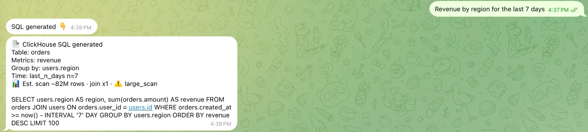
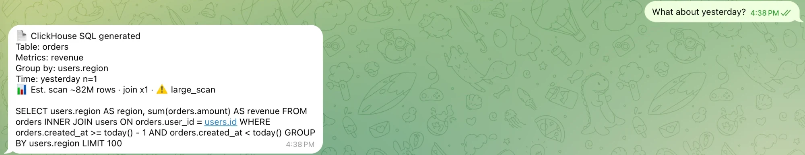
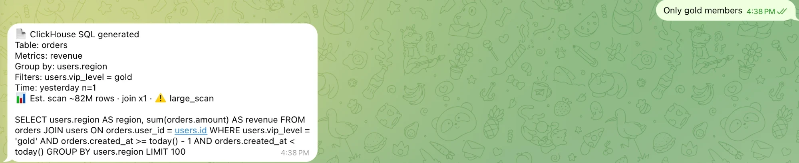
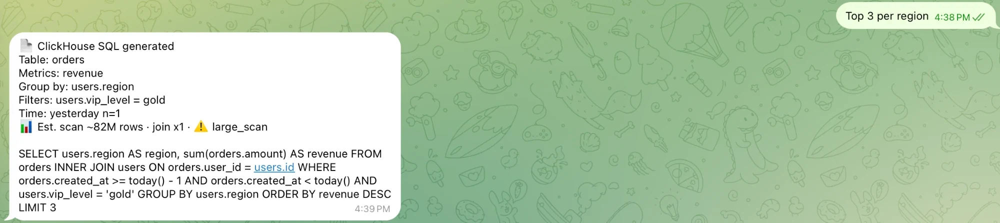
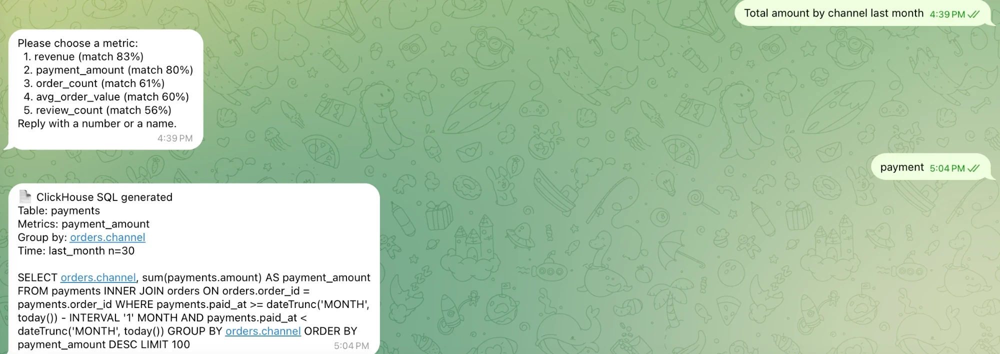

# Live Demo

[English](LIVE_DEMO.md) | [简体中文](LIVE_DEMO.zh-CN.md)

在同一个 Telegram 对话里发送 5 条消息，就能看到主要能力：表由指标推断；follow-up 在上一轮查询上 patch，而不是重新开始；
有歧义的问题会给出简短选项，而不是猜。每次回复大约 8–11 秒（两次 LLM 调用）。Bot 只返回校验后的 ClickHouse SQL，
执行查询不在本 demo 范围内。

demo schema 只有英文别名，请用英文提问。

## 演示步骤

### 1. Revenue by region for the last 7 days

问题里没有提表名。表（`orders`）由指标 `revenue` 推断出来；为了 `region` 自动加上到 `users` 的 join；并加上最近 7 天的时间过滤。



### 2. What about yesterday?

follow-up：只改时间范围，指标、表和分组都继承第 1 步。



### 3. Only gold members

又一个 follow-up：在上一轮查询基础上加一个过滤条件（`users.vip_level = 'gold'`）。



### 4. Top 3 per region

分组排名：查询变成 `LIMIT 3 BY users.region`，即 ClickHouse 的分组 top-N 语法。



### 5. Total amount by channel last month

一个新问题，带一个有歧义的词："amount" 可能指订单金额（`revenue`），也可能指支付金额（`payment_amount`）。两者分数接近且都低于采纳线，
所以 Bot 列出候选让你选，而不是猜。回复 `payment`，它会基于 `payments` 生成 SQL，并 join `orders` 取 channel。

建议按名称回复而不是按序号：选项顺序每次可能不同。



### 现场演示注意事项

- 5 条消息请在一小时内发完：会话空闲超过 60 分钟会被清理，之后的 follow-up 就没有上一轮查询可以依据。
- 确认会让系统"学习"：第 5 步确认后，memory writer 可能在 `data/memory/project_55/auto_learned.md` 里记下类似
  "amount → payment_amount" 的规则，下一次可能就不再询问。演示前请检查这个文件。
- 想看每个结果由哪条规则得出（例如 `table (not given) → orders · inferred_from_metric revenue`），启动服务时设置
  `TRACE_IN_REPLY=true`，trace 会附在每条回复末尾。

## 自己运行

### 1. 设置环境变量

```bash
# 必需：Telegram Bot Token
export TELEGRAM_BOT_TOKEN="your_bot_token_here"

# LLM 配置
export LLM_BACKEND="zhipu"  # 或 "ollama"
export ZHIPU_API_KEY="your_zhipu_key"  # 如果用 zhipu
export OLLAMA_BASE_URL="http://localhost:11434/v1"  # 如果用 ollama

# 可选：在每条 Telegram 回复末尾附上 resolution trace
export TRACE_IN_REPLY=true
```

### 2. 启动服务

```bash
python server.py
```

然后在同一个对话里，把上面 5 条消息依次发给你的 Bot。

## 调试

### API 文档

```text
http://localhost:8000/docs
```

### 查看会话列表

```bash
curl http://localhost:8000/sessions
```

### 直接测试 Text2SQL API

```bash
curl -X POST http://localhost:8000/nl2sql \
  -H "Content-Type: application/json" \
  -d '{"text": "Revenue by region for the last 7 days", "project_id": 55}'
```

响应里的 `explain.trace` 就是上面提到的 resolution trace。

## 常见问题

1. Telegram Bot 无响应。

- 检查 `TELEGRAM_BOT_TOKEN` 是否正确。
- 检查服务日志中的错误信息。

2. LLM 调用失败。

- 检查 `LLM_BACKEND`。
- 如果用 zhipu，检查 `ZHIPU_API_KEY`。

3. "What about yesterday?" 这类 follow-up 返回 "You have not entered any table, metric or query condition"。

- 上一轮已经不在了，通常是会话空闲超过 60 分钟被清理。重新问一次完整的问题即可。这种情况下 trace 会显示
  `turn new_query (no_previous_state)`。

4. 记忆文件不可见。

- 运行时数据存储在配置的 `data/` 目录下。
- 检查 `data/memory/`、`data/sessions/`、`data/user_preferences/`。
