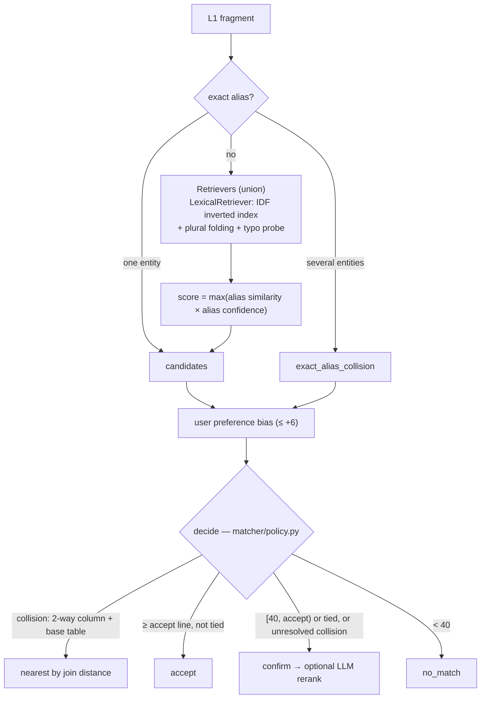
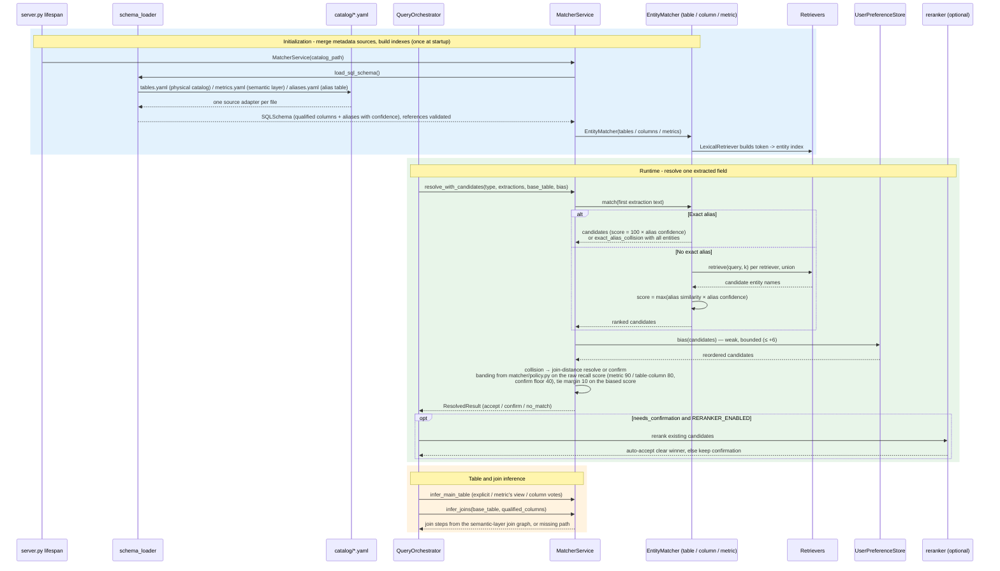

This page expands Layers 1 and 2 of the [Text2SQL pipeline](/ARCHITECTURE): how the LLM copies phrases out of the question, and how those phrases become canonical table / column / metric / time names — retrieval, scoring and the decision policy, the declared metadata they read from, and how filter values are resolved to real stored values.

## Layer 1: LLM Extraction

Owned by [service/llm_extractions.py](https://github.com/frankzh0330/text2sql-agent/blob/master/service/llm_extractions.py).

Responsibilities:

- turn user text into structured extraction objects
- inject session context and selected project memory
- use follow-up-aware prompt wording to avoid rebuilding full state when patching

Input:

- `text`
- recent session context
- `last_query_state`
- selected `memory_corrections`

Output:

- `SQLIntentJson` (table / metric / column / filter / group_by / time / order / window fragments)

## Layer 2: Matcher Resolution

Owned by [matcher/matcher_service.py](https://github.com/frankzh0330/text2sql-agent/blob/master/matcher/matcher_service.py) (decision + table/join inference),
[matcher/entity_matcher.py](https://github.com/frankzh0330/text2sql-agent/blob/master/matcher/entity_matcher.py) (one `EntityMatcher` for tables, columns and metrics),
[matcher/policy.py](https://github.com/frankzh0330/text2sql-agent/blob/master/matcher/policy.py) (every threshold) and [time_matcher.py](https://github.com/frankzh0330/text2sql-agent/blob/master/matcher/time_matcher.py),
over the merged metadata from [matcher/schema_loader.py](https://github.com/frankzh0330/text2sql-agent/blob/master/matcher/schema_loader.py).

The same resolution as a component sequence, from startup to a single resolved field. Before the first query, `MatcherService` loads the three metadata sources through `schema_loader`, builds the entity matchers and their retrieval indexes once; at runtime each extracted fragment then flows through recall, scoring, preference bias and the policy decision:

Responsibilities:

- resolve `table / table.column / metric_id / time_range` with scores and candidates
- candidate generation (`EntityMatcher`): the query and every alias are first plural-folded (`product categories` ≡ `product category`; `-ies` → `-y`; `-ss/-us/-is` left alone), and exact lookup and scoring run on the folded key; exact alias hits short-circuit; otherwise every configured `Retriever` recalls top-k entity names and the union is scored. The default `LexicalRetriever` is IDF-weighted (BM25-lite) so discriminative tokens outrank generic ones (table/amount/id), folds plurals in recall tokens too (`customers` -> `customer`), and probes zero-hit tokens >= 4 chars against the vocabulary at edit distance 1 ('orde tablez' -> orders) at 0.75x weight
- scoring: `max(alias similarity × alias confidence)`, where confidence comes from the alias source (curated 1.0 … llm 0.5). WRatio substring matching is allowed only when the query is at least as long as the alias, so a short query cannot win on a longer alias's prefix (`customer` scores 67 against `customer reviews`, 94 against `customers`)
- one decision function (`resolve_with_candidates`) with a fixed order — preference bias → collision handling → banding — and all thresholds in `matcher/policy.py`: metric auto-accepts at >= 90 (a wrong metric means wrong numbers), table/column at >= 80; scores in [40, threshold) require confirmation; < 40 is no match. A tie guard additionally forces confirmation when the top-2 candidate margin is < 10, even above the acceptance line
- exact-alias collisions (same alias on multiple entities, e.g. `amount` on orders/payments, `time` on three tables) are surfaced, never silent first-wins: two-way column collisions with a base-table context resolve deterministically by join-graph distance (nearest wins, e.g. `region` in an orders context -> users.region); 3-way generic tokens or ties escalate to the confirmation flow with all candidates
- columns (group-by / detail / window group) follow the same decision: a column that needs confirmation is escalated, never silently replaced by the recall top-1
- infer the main table when the user does not name one (metric expression or column ownership)
- infer join steps from the declarative join graph in the semantic layer; missing paths escalate to confirmation

Important detail:

- user preference is a bounded candidate bias applied **before** the accept/confirm decision; it can break a tie or reorder candidates, and a flip is marked `+user_bias` in `method`
- optional constrained LLM rerank ([service/reranker.py](https://github.com/frankzh0330/text2sql-agent/blob/master/service/reranker.py), `RERANKER_ENABLED=true`) runs only when the decision lands in the confirmation band; it may reorder existing candidates but never invent new values, and silently accepts only a clear winner (relevance >= 85 and margin >= 15); production can swap in a local cross-encoder model (e.g. bge-reranker-v2-m3) behind the same interface
- matcher itself remains the main semantic resolver
- recall is pluggable: an embedding `Retriever` can be added without touching scoring or the decision policy (see [Catalog and Metadata](#catalog-and-metadata))

## Catalog and Metadata

Metadata is split the way it is in an enterprise: each checked-in file mocks one independently maintained
system and is read by its own source adapter in [matcher/schema_loader.py](https://github.com/frankzh0330/text2sql-agent/blob/master/matcher/schema_loader.py);
the adapters' output is merged into one in-memory `SQLSchema`, and cross-file references are validated at load
time (fail fast).

| File | Mocks | Contents |
|------|-------|----------|
| [catalog/tables.yaml](https://github.com/frankzh0330/text2sql-agent/blob/master/catalog/tables.yaml) | Physical catalog (Unity Catalog / DataHub / OpenMetadata / `INFORMATION_SCHEMA`), machine-maintained | tables, columns, types, comments, owner, row counts, profiled distinct values of low-cardinality columns |
| [catalog/metrics.yaml](https://github.com/frankzh0330/text2sql-agent/blob/master/catalog/metrics.yaml) | Semantic layer (LookML) | governed metric definitions, the join graph, each view's default time dimension |
| [catalog/aliases.yaml](https://github.com/frankzh0330/text2sql-agent/blob/master/catalog/aliases.yaml) | Alias table | `(entity_id, alias, source, confidence, status, updated_by)` rows |

Alias sources and default confidence (a row may override it):

| Source | Confidence | Origin |
|--------|-----------|--------|
| curated | 1.0 | hand-written, git reviewed (core metrics and definitions) |
| glossary | 0.9 | catalog business-glossary term bound to a column or metric |
| comment | 0.7 | derived from catalog column comments |
| query_log | 0.6 | mined from historical SQL plus ticket / question text |
| feedback | 0.6 | user picks in the confirmation flow, promoted after accumulating |
| llm | 0.5 | generated offline from names, comments and samples; starts `pending` |

`pending` rows are not indexed until reviewed. The canonical name of each entity is always an alias with
confidence 1.0. Confidence multiplies the match score, so an exact hit on a 0.6 alias scores 60 and goes to
confirmation instead of being auto-accepted. The demo aliases are English only, so demo queries should be asked in
English.

The intended production direction is (summarized side by side on [Demo vs Production](/PRODUCTION)):

- each source adapter is swapped for the real client (Unity Catalog REST for tables, the LookML / dbt
  semantic-layer API for metrics and joins, the alias DB table for aliases), synced periodically
- after a sync, call `load_sql_schema()` to hot-rebuild the matcher indexes
- no sync scheduler is implemented yet: the demo catalog is loaded once at server startup (`server.py` lifespan)
  and a YAML change needs a restart; the hot-rebuild seam is ready (`load_sql_schema()` -> rebuild `MatcherService` ->
  `set_matcher_service()` swap)
- semantic recall: `EntityMatcher(entities, retrievers=[...])` unions the candidates of every `Retriever`
  (`retrieve(query, k) -> (names, explain)`); scoring and the decision policy are unchanged. To add embedding
  recall, embed each entity's aliases + comment/description offline into a vector index, implement a `Retriever`
  that embeds the query and returns the top-k entity names, and pass it alongside `LexicalRetriever`
- query execution (read-only account, timeouts, cost limits) and result rendering belong to downstream layers and
  are out of scope for this demo

This matters because real deployments may have:

- tens of thousands of tables and columns
- multiple business aliases per column
- project-specific vocabularies and constraints

## Filter Value Resolution

A filter such as "paid by credit card" has two parts to resolve: the **column**
(`payments.payment_type`) and the **value** (`credit_card`). The LLM only copies the
user's words, so the value it extracts (`credit card`) rarely equals what is stored.
Getting this wrong produces SQL that passes static validation but returns nothing or the
wrong rows, which the live eval surfaced (see [Evaluation Strategy](#evaluation-strategy)).

### What this repository does

- **Column**: [orchestrator](https://github.com/frankzh0330/text2sql-agent/blob/master/service/query_orchestrator.py) accepts a filter column only on a
  high-confidence match (score >= 80). Low-confidence or unmatched columns are never guessed
  from the recall list; the request ends with `early_exit` and the closest columns, so the user
  can rephrase. (A hallucinated `user_type` used to be fuzzy-matched to `orders.user_id`.)
- **Value**: columns may carry profiled `distinct_values` in [catalog/tables.yaml](https://github.com/frankzh0330/text2sql-agent/blob/master/catalog/tables.yaml) (loaded as `enum_values`).
  `SQLSchema.normalize_enum_value()` maps the extracted value to a declared one
  deterministically: exact, then case/space/hyphen-insensitive (`Credit-Card` -> `credit_card`),
  then RapidFuzz >= 90 (`cancelled` -> `canceled`). A value that matches nothing is passed through and
  recorded in `explain`; it does not block the query.

### Why hand-written enums do not scale

`enum_values` fits low-cardinality, stable columns (`status`, `payment_type`, `vip_level`).
It does not fit high-cardinality or changing columns (brand, city, product name), and nobody can
maintain a hand-written list for every column of a real warehouse. It is a demo-scale choice.

### How production systems approach it

| Approach | Idea | Reference |
|---|---|---|
| Cached frequent values + fuzzy match | Pick searchable text columns by cardinality/type, cache the most frequent values, match filters with edit distance, generate synonyms/abbreviations with an LLM | [SQLGenie (ACL 2025 Industry)](https://aclanthology.org/2025.acl-industry.71.pdf) |
| Index all values | LSH plus semantic embeddings, hierarchical retrieval; give the LLM only the relevant value subset (offline index, online retrieval) | [CHESS](https://scalingintelligence.stanford.edu/pubs/CHESSpaper.pdf), [XiYan-SQL](https://arxiv.org/pdf/2411.08599), [DeepEye-SQL](https://arxiv.org/pdf/2510.17586) |
| Sample values in the prompt | 3-5 representative values for low-cardinality categorical columns | [DexterSQL](https://arxiv.org/pdf/2608.11889) |
| Semantic-layer aliases | Humans maintain metric, dimension and value aliases/synonyms, backed by golden-query regression tests | [Semantic Layers Make Enterprise Text-to-SQL Safer](https://datalakehousehub.com/blog/2026-05-semantic-layers-text-to-sql/), [dbt: Semantic Layer vs. Text-to-SQL](https://docs.getdbt.com/blog/semantic-layer-vs-text-to-sql-2026) |

These are usually combined: low-cardinality columns get sample values or a cached list, high-cardinality
columns get a value index, and business vocabulary lives in the semantic layer.

The public material is thin on operational details (how values that change over time are refreshed, how
ambiguous values are disambiguated with the user). Treat those as open design questions, not established practice.

### Intended direction for this project

Replace the mocked `distinct_values` in `tables.yaml` with values synced from the warehouse (distinct/top-K per eligible column,
refreshed on the same schedule as the metadata sync), keep `normalize_enum_value()` as the deterministic
first pass, and add an embedding or LSH value index for high-cardinality columns. Ambiguous or unmatched values should
go through the confirmation flow instead of being passed through.
