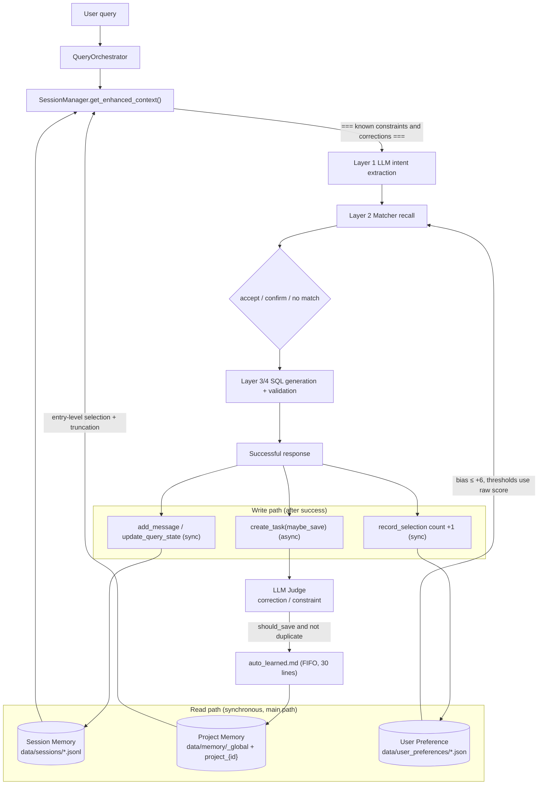
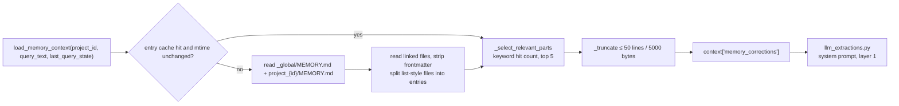
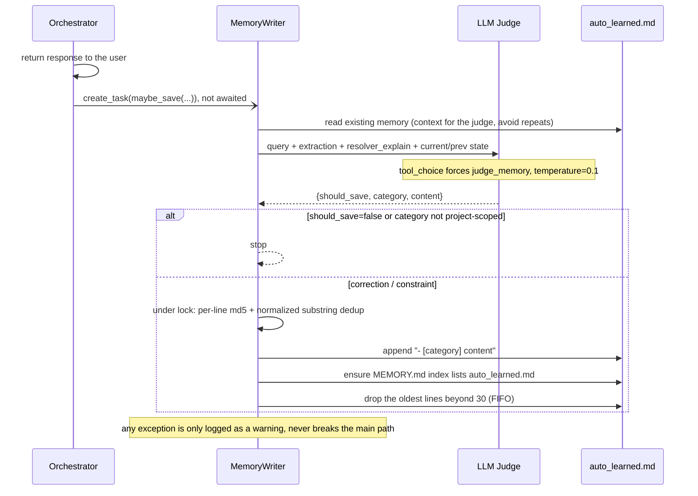
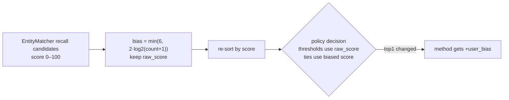

[Chinese version](https://github.com/frankzh0330/text2sql-agent/blob/master/docs/MEMORY.zh-CN.md)

This document explains the memory design in `text2sql-agent`: why the project cannot treat “memory” as chat history alone, why it needs at least three kinds of memory, and how the current implementation maps to that model (read path, async write path, and the guardrails on each).

## Why Memory Here Is Not a Single Layer

For a Text2SQL data agent, “memory” is not just chat history.

Different kinds of knowledge have different:

- scope
- lifetime
- trust level
- usage point in the pipeline

If these are mixed together, the system becomes less reliable:

- short-lived turn state may leak across sessions
- user-specific habits may pollute other users
- project-wide business rules may be mistaken for user preference

That is why this project should not stop at:

- session memory
- user memory

The more natural split is:

- Session Memory
- Project Memory
- User Preference Signal

## Overview

| Kind | Scope | Lifetime | Trust | How it is written | Where it takes effect |
|---|---|---|---|---|---|
| Session Memory | session | short | high | synchronous JSONL write every turn | follow-up merge, filling omitted fields |
| Project Memory | `_global` / project | long | high | hand-maintained + async LLM judge | Layer 1: injected into the extraction system prompt |
| User Preference | project + user | medium to long | medium (weak signal) | synchronous counter increment after each success | Layer 2: weak bias after recall, before the decision |



## Layer 1: Session Memory

### What It Stores

Session memory stores short-lived state for the current conversation:

- `last_query_state`
- `pending_task_id`
- recent messages (last 20)
- turn type metadata

### Where It Lives

- [service/session_models.py](https://github.com/frankzh0330/text2sql-agent/blob/master/service/session_models.py)
- [service/session_manager.py](https://github.com/frankzh0330/text2sql-agent/blob/master/service/session_manager.py)
- [service/task_manager.py](https://github.com/frankzh0330/text2sql-agent/blob/master/service/task_manager.py)
- [memory/storage/memory_file.py](https://github.com/frankzh0330/text2sql-agent/blob/master/memory/storage/memory_file.py): `JsonlStorage` is append-only with `fsync` and skips corrupted lines on read; compaction kicks in above 500 lines and keeps the latest 100. `TaskStorage` reuses the same base class, so confirmation tasks survive restarts.

### Why It Exists

It solves turn-based continuity:

```text
Q1: Revenue by region for the last 7 days
Q2: Yesterday
Q3: Change it to order count
```

Without session memory, the system would have to re-infer every field on every turn.

### Characteristics

- scope: current session
- lifetime: short
- trust: high
- usage point: before and during turn resolution

## Layer 2: Project Memory

### What It Stores

Project memory stores project-level business knowledge:

- default table/metric mappings
- business constraints
- correction rules
- dimension/property caveats
- project-specific interpretation rules

Examples:

- “In this project, "big orders" means orders with amount greater than 1000”
- “In this project, '交易表' (transaction table) maps to the orders table” (a real auto-learned record)
- “revenue excludes cancelled orders by default”

### Where It Lives

- [memory/long_term_memory.py](https://github.com/frankzh0330/text2sql-agent/blob/master/memory/long_term_memory.py): loading and selection
- [memory/memory_writer.py](https://github.com/frankzh0330/text2sql-agent/blob/master/memory/memory_writer.py) + [memory/judge_prompt.py](https://github.com/frankzh0330/text2sql-agent/blob/master/memory/judge_prompt.py): async auto-learning
- runtime files:

```text
data/memory/
  ├── _global/            # shared by all projects
  │   ├── MEMORY.md       # index: - [title](file.md)
  │   └── *.md
  └── project_{id}/       # injected only for this project
      ├── MEMORY.md
      ├── *.md            # hand-maintained
      └── auto_learned.md # written by MemoryWriter
```

### Why It Exists

This kind of knowledge:

- is not temporary session state
- is not one user's personal habit
- but is critical for query correctness

It matters most in environments with large metadata, for example:

- tens of thousands of tables and columns
- many business aliases per column
- heavily overlapping natural-language expressions

There, correctness depends on project semantics, not just string matching.

### Read Path



Details:

- **Two-level buckets**: `_global/` applies to every project; `project_{id}/` applies only to that project.
- **Entry granularity**: pure list files (such as `auto_learned.md`, one `- [category] ...` per line) are split into one entry per top-level list item; prose documents stay whole as a single entry.
- **Per-query selection**: keywords = English tokens of the query + Chinese runs and their bigrams + tables / metrics / group_by / detail_columns from `last_query_state`. Entries are ranked by hit count and the top 5 are kept; if nothing matches, it conservatively falls back to the first 2 entries so context is not lost entirely.
- **Cache**: only the raw entries read from disk are cached (key = project_id, invalidated by the newest `.md` mtime); selection is recomputed every turn from the current query.
- **Injection point**: only affects Layer 1 intent extraction; the LLM still does not decide entity names.

### Write Path (Async Auto-Learning)

There are two triggers: a normal successful query, and a completed confirmation flow (which also passes `confirmed_selection`, the strongest correction signal).



The judge only produces two kinds of project-level knowledge:

- `correction`: the user rejected the system default (especially by picking a different value in the confirmation flow)
- `constraint`: a project-specific rule, e.g. “purchase means payment_submit in this project”

Personal habits (“I usually look at the last 30 days”) are **not written** to project memory: they would be injected for every user of the project, which is a scope leak. Even if the judge returns another category, `MemoryWriter` drops it. Ordinary high-confidence successful queries are not written either.

### Characteristics

- scope: `_global` / project
- lifetime: long
- trust: high
- usage point: context injection before extraction

## Layer 3: User Preference Signal

### What It Stores

User preference stores lightweight usage habits (counts):

- frequently used tables
- frequently used metrics
- frequently used group-by dimensions

Examples:

- user A often queries `refund_rate`
- user A usually prefers `order_count`
- user A often groups by `orders.channel`

### Where It Lives

- [memory/user_preference_store.py](https://github.com/frankzh0330/text2sql-agent/blob/master/memory/user_preference_store.py)
- takes effect in: the `bias` argument of `resolve_with_candidates` in [matcher/matcher_service.py](https://github.com/frankzh0330/text2sql-agent/blob/master/matcher/matcher_service.py)
- runtime files: `data/user_preferences/project_{id}__user_{uid}.json`

### Why It Exists

When several candidates all “look plausible”, a preference signal helps order them.

But it is not the same thing as project business semantics.

### Mechanism



- **Write**: after each success (including a completed confirmation), only the first table, the first metric, and the first 2 group_by columns are counted (+1); writes are locked and go through a temp file plus atomic replace.
- **Bias curve**: 1 use → +2, 3 uses → +4, 7 or more → capped at +6.
- **Explainability**: explain records `raw_score`, `preference_count`, and `preference_bias`.

### Very Important Constraint

In the current implementation, user preference is explicitly limited to:

- a bounded weak bias (max +6) on candidates after recall, before the accept/confirm decision
- the accept line and `CONFIRM_FLOOR` only look at the raw recall score: preference can break ties between candidates that already clear the bar, but cannot turn a low-confidence candidate into a silent accept on bias alone, nor pull a below-floor candidate into confirmation

It is not:

- the primary resolver
- a hard override rule

That means:

1. the matcher still owns primary semantic recall
2. preference only slightly reorders top candidates (including the order shown in confirmation)
3. scope is strictly `project_id + user_id`

This avoids overfitting to user history, and it cuts the self-reinforcing loop of “preference causes a silent accept → count +1 → preference gets stronger”.

### Characteristics

- scope: project + user
- lifetime: medium to long
- trust: medium
- usage point: after recall, before final selection

## Why User Preference Should Not Replace Matching

Consider:

```text
User history: often queries refund_rate
Current query: Show the cancellation rate
```

If preference were weighted too heavily, the system could be pulled toward a metric the user often uses but that is irrelevant this turn.
So user preference must stay a weak signal.

Good use:

- rerank top-k candidates

Bad use:

- global bias before recall
- overriding a clearly stronger semantic match
- boosting a below-threshold candidate over the threshold

## Why Project Memory Is Different From User Preference

Consider this rule:

```text
In this project, "big orders" means orders with amount greater than 1000
```

This is not:

- temporary session information
- one user's private habit

It holds for anyone querying this project.
So it belongs in project memory, not user preference.

Conversely, “I usually look at the last 30 days” only holds for the person who said it, so MemoryWriter does not write it to project memory.

That is why this project needs at least three kinds of memory, not two.

## Current Priority Order

The current priority order is:

```text
explicit user input
  > session state
  > project memory
  > user preference rerank
```

Meaning:

- explicit user input is strongest
- session state fills omitted fields
- project memory constrains the interpretation space
- user preference only slightly affects ordering

## What Is Already Implemented

Implemented today:

- session persistence and recovery (JSONL + compaction)
- `last_query_state`
- `pending_task_id`, with confirmation tasks recovered across restarts
- two-level project memory (`_global` + `project_{id}`) loaded via the `MEMORY.md` index
- entry-level, per-query project memory selection (cache decoupled from selection)
- async auto-learning via an LLM judge (correction / constraint only, dedup + FIFO)
- user preference usage counts (locked + atomic write)
- preference rerank scoped by `project_id + user_id`, with thresholds on raw score

Not fully implemented yet:

- richer `UserAlias`
- richer `UserPattern`
- richer `UserPreferences` (e.g. a stable default time range)
- persisted `QueryHistory`
- category-aware memory retrieval (e.g. `constraint > correction`)
- cross-session user memory beyond simple counts
- write mutual exclusion across processes (the current locks are per-process only)

## Why Short-Term QueryState Does Not Need AI Summarization

Short-term query state is already structured.

For example:

```json
{
  "tables": ["orders"],
  "metrics": ["revenue"],
  "time_range": {"type": "last_n_days", "n": 7},
  "group_by": ["users.region"],
  "window": {"group_by": "users.region", "limit": 3}
}
```

It is already more precise than a text summary.
So for session memory, AI summarization is usually unnecessary.

## Where AI-Like Selection May Still Help Later

Long-term memory is different; it keeps growing:

- project rules
- correction rules
- caveats

As it grows, the system may later need smarter selection for:

- memory snippet choice
- few-shot example choice
- ambiguous explanation generation

So “AI retrieval/summarization does not apply” only holds for short-term structured turn state, not for memory as a whole.

## Recommended Next Steps

1. add category-aware project memory retrieval
2. split `UserAlias`, `UserPattern`, and `UserPreferences` out of simple counts, to take over the personal preferences the judge no longer writes
3. add persisted `QueryHistory` for replay, pattern aggregation, and failure analysis
4. consider a hybrid Markdown + embedding index for long-term project memory retrieval
5. add more project memory / user preference eval cases
6. add a conflict policy for when project memory and user preference disagree
7. move file writes to external storage or file locks for multi-process deployments

## User Memory Evolution

Future user memory should not stop at the current lightweight usage counter.

Recommended split:

- `UserAlias`: explicit or learned aliases, e.g. “大单” (big orders) -> `orders.amount > 1000` filter
- `UserPattern`: aggregated top tables, metrics, columns, query frequency
- `UserPreferences`: stable defaults, e.g. preferred metric, table, time range
- `QueryHistory`: persisted query traces for replay, evaluation, pattern learning

Recommended storage:

- PostgreSQL: persisted user records and query history
- Redis: cache hot per-user/project context
- optional Vector DB: semantic recall over long-term memory and examples

Even with these capabilities, user memory should stay weaker than explicit input, session state, and
project memory.
