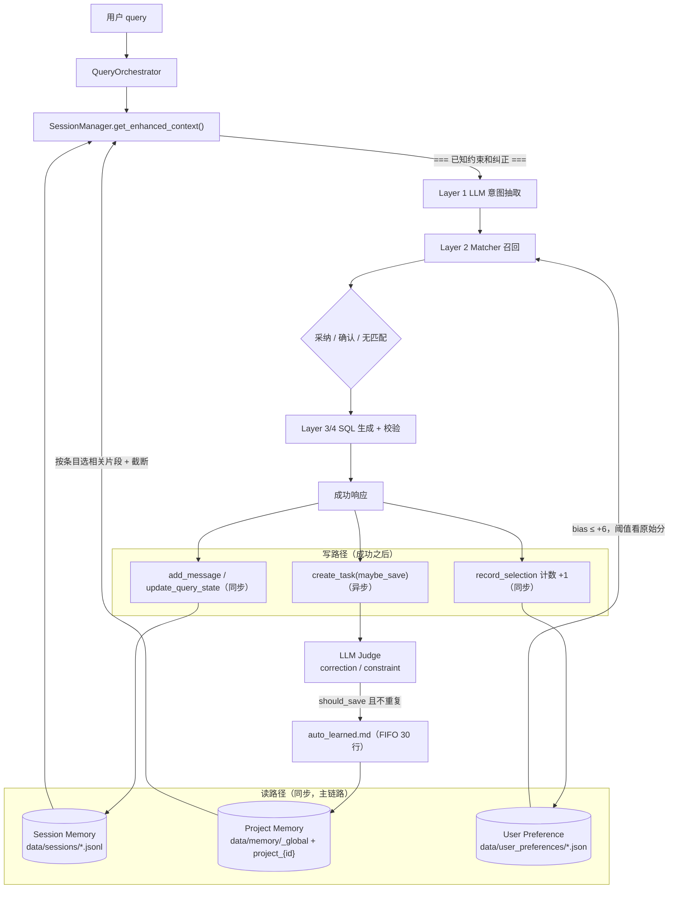
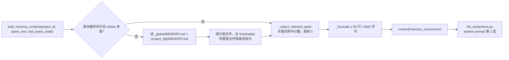
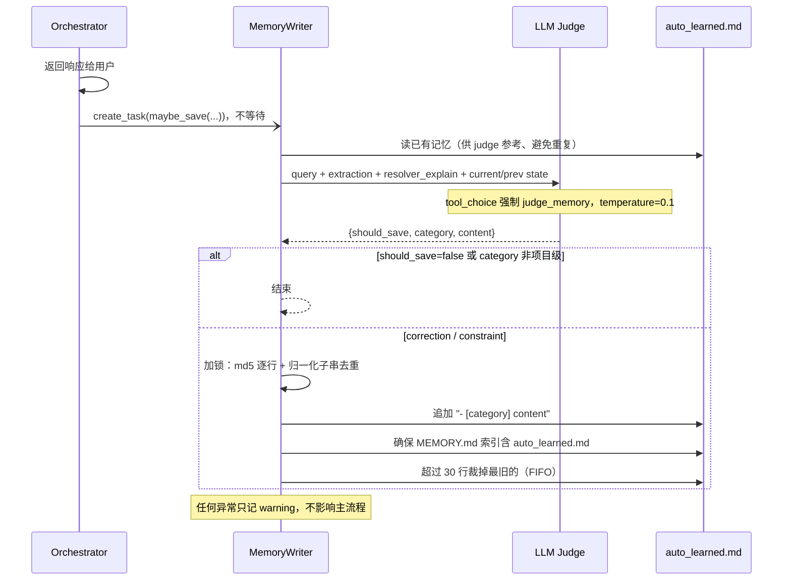
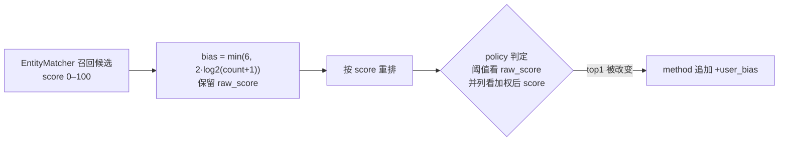

# Memory 架构

[English](MEMORY.md) | [简体中文](MEMORY.zh-CN.md)

本文说明 `text2sql-agent` 里的 memory 设计：为什么这个项目不能只把“memory”看成聊天历史、为什么至少要分成 3 类，以及当前代码实现如何映射到这套模型（读路径、异步写路径、各自的护栏）。

## 为什么这里的 Memory 不是只有一层

对数据查询 agent 来说，“memory” 不只是聊天记录。

不同来源的知识有不同的：

- 作用域
- 生命周期
- 可信度
- 使用位置

如果把这些全混在一起，系统会变得更不可靠：

- 短期 turn state 可能跨 session 泄漏
- 某个用户的习惯会污染其他用户
- 项目级业务规则会被误当成用户偏好

所以这个项目不应该停留在：

- session memory
- user memory

更自然的拆法是：

- Session Memory
- Project Memory
- User Preference Signal

## 总览

| 类型 | 作用域 | 生命周期 | 可信度 | 写入方式 | 生效位置 |
|---|---|---|---|---|---|
| Session Memory | session | 短 | 高 | 每轮同步写 JSONL | follow-up 合并、补全省略字段 |
| Project Memory | `_global` / project | 长 | 高 | 人工维护 + LLM judge 异步写入 | Layer 1：注入抽取 system prompt |
| User Preference | project + user | 中到长 | 中（弱信号） | 每次成功后同步累加计数 | Layer 2：recall 后、判定前弱加权 |



## 第一层：Session Memory

### 存什么

Session memory 存当前会话里的短期状态：

- `last_query_state`
- `pending_task_id`
- recent messages（最近 20 条）
- turn type metadata

### 在哪里

- [service/session_models.py](../service/session_models.py)
- [service/session_manager.py](../service/session_manager.py)
- [service/task_manager.py](../service/task_manager.py)
- [memory/storage/memory_file.py](../memory/storage/memory_file.py)：`JsonlStorage` 只追加写入 + `fsync`，读取时跳过损坏行；超过 500 行触发 compaction，保留最近 100 条。`TaskStorage` 复用同一基类，确认流任务可跨重启恢复。

### 为什么需要

它解决的是 turn-based 连续性：

```text
Q1: Revenue by region for the last 7 days
Q2: Yesterday
Q3: Change it to order count
```

如果没有 session memory，系统每一轮都得重新推断全部字段。

### 特征

- 作用域：当前 session
- 生命周期：短
- 可信度：高
- 使用位置：turn 解析前和解析中

## 第二层：Project Memory

### 存什么

Project memory 存项目级业务知识：

- 默认表/指标 mapping
- 业务约束
- 纠正规则
- dimension/property caveats
- 项目特有的解释规则

例子：

- “在这个项目里，"big orders" 指金额大于 1000 的订单”
- “本项目的'交易表'对应 orders 表”（真实的自动学习记录）
- “revenue 默认排除已取消订单”

### 在哪里

- [memory/long_term_memory.py](../memory/long_term_memory.py)：读取与选择
- [memory/memory_writer.py](../memory/memory_writer.py) + [memory/judge_prompt.py](../memory/judge_prompt.py)：异步自动学习
- 运行时文件：

```text
data/memory/
  ├── _global/            # 所有项目共享
  │   ├── MEMORY.md       # 索引：- [标题](文件.md)
  │   └── *.md
  └── project_{id}/       # 只注入给该项目
      ├── MEMORY.md
      ├── *.md            # 人工维护
      └── auto_learned.md # MemoryWriter 自动写入
```

### 为什么需要

这类知识：

- 不是临时 session 状态
- 也不是某个用户的个人习惯
- 但对查询正确性非常关键

在真实 metadata 很大的环境里，这层尤其重要，例如：

- 数万级表和列
- 每个列很多业务别名
- 自然语言表达高度重叠

这时正确性很大程度上依赖项目语义，而不只是字符串匹配。

### 读路径



细节：

- **两级分桶**：`_global/` 对所有项目生效，`project_{id}/` 只对本项目生效。
- **条目粒度**：纯列表文件（如 `auto_learned.md`，每行一条 `- [category] ...`）按顶层列表项拆成独立条目；说明性文档整文件作为一个条目，保持完整。
- **按 query 选择**：关键词 = query 的英文 token + 中文整段及 bigram + `last_query_state` 的 tables / metrics / group_by / detail_columns。按命中数排序取前 5；全部未命中时保守回退前 2 条，避免完全丢失上下文。
- **缓存**：只缓存磁盘读出的原始条目（key = project_id，按 `.md` 最新 mtime 失效）；选择每轮都基于当前 query 重新计算。
- **注入位置**：只影响 Layer 1 意图抽取，不让 LLM 决定实体名。

### 写路径（异步自动学习）

触发点有两个：普通查询成功、确认流完成（会额外带上 `confirmed_selection`，这是最强的纠正信号）。



judge 只产出两类项目级知识：

- `correction`：用户否定系统默认（尤其是确认流里选了别的值）
- `constraint`：项目特有规则，例如“purchase 在这个项目里就是 payment_submit”

个人习惯（“我一般看近 30 天”）**不写入** project memory：它会被注入给该项目所有用户，属于作用域泄漏。即使 judge 返回其他类别，`MemoryWriter` 也会丢弃。普通高置信成功查询同样不写。

### 特征

- 作用域：`_global` / project
- 生命周期：长
- 可信度：高
- 使用位置：extraction 前的 context injection

## 第三层：User Preference Signal

### 存什么

User preference 存轻量的使用习惯（计数）：

- 常用表
- 常用 metric
- 常用 group-by dimension

例子：

- user A 经常查 `refund_rate`
- user A 通常偏好 `order_count`
- user A 经常按 `orders.channel` 分组

### 在哪里

- [memory/user_preference_store.py](../memory/user_preference_store.py)
- 生效点：[matcher/matcher_service.py](../matcher/matcher_service.py) `resolve_with_candidates` 的 `bias` 参数
- 运行时文件：`data/user_preferences/project_{id}__user_{uid}.json`

### 为什么需要

当多个候选都“看起来说得通”时，偏好信号可以帮助排序。

但它和项目业务语义不是一回事。

### 机制



- **写入**：每次成功（含确认流完成）后，只记第一个 table、第一个 metric、前 2 个 group_by 列，计数 +1；写入加锁，先写临时文件再原子替换。
- **加分曲线**：1 次 +2，3 次 +4，7 次及以上封顶 +6。
- **可解释**：explain 记录 `raw_score`、`preference_count`、`preference_bias`。

### 一个非常重要的限制

当前实现里，用户偏好被明确限制为：

- recall 之后、采纳/确认判定之前的候选弱加权（上限 +6）
- 采纳线和 `CONFIRM_FLOOR` 只看召回原始分：偏好可以在都已过线的候选之间打破并列，但不能单凭加分把低置信候选推成静默采纳，也不能把低于下限的候选拉进确认流

而不是：

- 主解析器
- 硬覆盖规则

也就是说：

1. matcher 仍负责主要语义召回
2. preference 只轻微影响 top candidates 排序（包括确认流中候选的展示顺序）
3. 作用域严格限定为 `project_id + user_id`

这样可以避免对用户历史过拟合，也切断了“偏好导致静默采纳 → 计数再 +1 → 偏好更强”的自我强化回路。

### 特征

- 作用域：project + user
- 生命周期：中到长
- 可信度：中
- 使用位置：recall 后、最终选择前

## 为什么 User Preference 不能替代 Matching

看一个例子：

```text
用户历史：经常查 refund_rate
当前 query：Show the cancellation rate
```

如果 preference 权重过强，系统可能会被带向用户常用但本轮不相关的指标。
所以用户偏好必须保持为弱信号。

好的用法：

- rerank top-k candidates

不好的用法：

- 在 recall 前做全局偏置
- 覆盖一个明显更强的语义匹配
- 把未过线的候选加分到过线

## 为什么 Project Memory 和 User Preference 不一样

看这条规则：

```text
在这个项目里，"big orders" 指金额大于 1000 的订单
```

这不是：

- 临时 session 信息
- 某个用户的私人习惯

它对任何查询这个项目的人都成立。
所以它应该属于 project memory，不属于 user preference。

反过来，“我一般看近 30 天”只对说这句话的人成立，所以 MemoryWriter 不会把它写进 project memory。

这也是为什么这个项目至少要分 3 类 memory，而不是 2 类。

## 当前优先级

当前项目里更合理的优先级是：

```text
explicit user input
  > session state
  > project memory
  > user preference rerank
```

含义是：

- 显式用户输入最强
- session state 用来补全省略字段
- project memory 约束解释空间
- user preference 只轻微影响排序

## 已实现的部分

当前已经实现：

- session persistence and recovery（JSONL + compaction）
- `last_query_state`
- `pending_task_id`，确认流跨重启恢复
- `_global` + `project_{id}` 两级 project memory，经 `MEMORY.md` 索引加载
- 条目级、按 query 的 project memory 选择（缓存与选择解耦）
- LLM judge 异步自动学习（仅 correction / constraint，去重 + FIFO）
- user preference usage counts（加锁 + 原子写）
- 按 `project_id + user_id` 作用域做 preference rerank，阈值只看原始分

还没有完全实现：

- 更丰富的 `UserAlias`
- 更丰富的 `UserPattern`
- 更丰富的 `UserPreferences`（例如稳定的默认时间范围）
- 持久化 `QueryHistory`
- 按 category 做 memory retrieval（如 `constraint > correction`）
- 超过简单计数的跨 session user memory
- 多进程部署下的写入互斥（当前锁只在单进程内有效）

## 为什么短期 QueryState 不需要 AI 摘要

短期 query state 已经是结构化的。

例如：

```json
{
  "tables": ["orders"],
  "metrics": ["revenue"],
  "time_range": {"type": "last_n_days", "n": 7},
  "group_by": ["users.region"],
  "window": {"group_by": "users.region", "limit": 3}
}
```

它已经比文本摘要更精确。
所以对 session memory 来说，AI 摘要通常没有必要。

## 但为什么长期知识选择以后仍可能需要 AI

长期 memory 不一样，它会越来越多：

- 项目规则
- 纠正规则
- caveats

当这些越来越多时，系统以后可能需要更智能的选择，用于：

- memory snippet choice
- few-shot example choice
- ambiguous explanation generation

所以“AI retrieval/summarization 不适用”只适用于短期结构化 turn state，不适用于 memory 的全部问题。

## 建议下一步

1. 加 category-aware 的 project memory retrieval
2. 把 `UserAlias`、`UserPattern`、`UserPreferences` 从简单计数里拆开，承接 judge 不再写入的个人偏好
3. 增加持久化 `QueryHistory`，用于 replay、pattern aggregation、failure analysis
4. 对长期 project memory retrieval 考虑 hybrid Markdown + embedding index
5. 扩更多 project memory / user preference 的 eval case
6. 增加 project memory 和 user preference 冲突时的处理策略
7. 多进程部署时把文件写入换成外部存储或文件锁

## User Memory 演进方向

未来 user memory 不应只停留在当前的轻量 usage counter。

推荐拆分：

- `UserAlias`：显式或学习到的别名，例如 “大单” -> `orders.amount > 1000` 过滤
- `UserPattern`：聚合后的 top tables、metrics、columns、query frequency
- `UserPreferences`：稳定默认值，例如常用 metric、table、time range
- `QueryHistory`：持久化 query trace，用于 replay、evaluation、pattern learning

推荐存储：

- PostgreSQL：持久化 user records 和 query history
- Redis：缓存热点 per-user/project context
- 可选 Vector DB：对长期 memory 和 examples 做 semantic recall

即使引入这些能力，user memory 也应该弱于 explicit input、session state 和
project memory。
