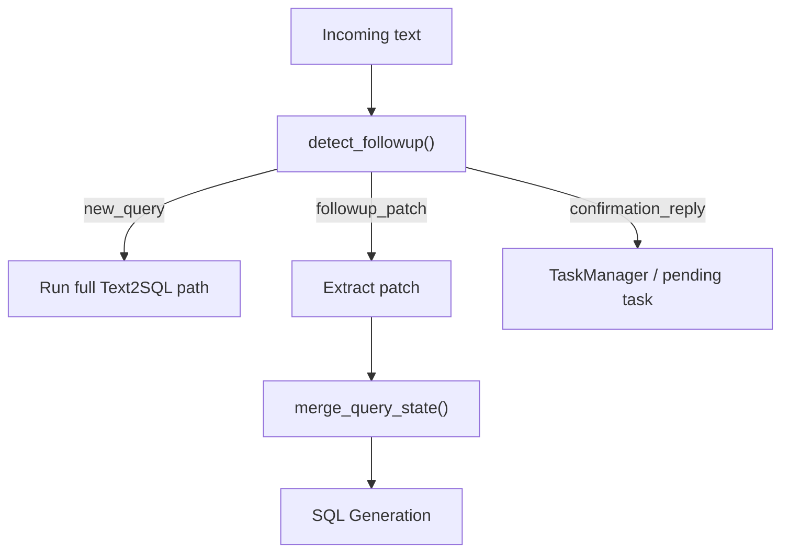
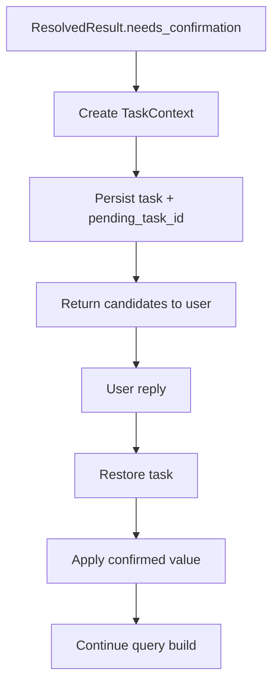

This page expands the multi-turn half of the [Architecture Overview](/ARCHITECTURE): turn modes, the follow-up patch merge, the confirmation flow that survives restarts, and behavior-level scenarios that validate the design end to end.

## Turn-Based Querying

Turn-based behavior is a first-class part of the architecture, not a prompt trick.

### Core Building Blocks

- [service/session_models.py](https://github.com/frankzh0330/text2sql-agent/blob/master/service/session_models.py)
  - `QueryState`
  - `SessionContext`
  - `TaskContext`
- [service/followup_resolver.py](https://github.com/frankzh0330/text2sql-agent/blob/master/service/followup_resolver.py)
- [service/query_state_merger.py](https://github.com/frankzh0330/text2sql-agent/blob/master/service/query_state_merger.py)
- [service/task_manager.py](https://github.com/frankzh0330/text2sql-agent/blob/master/service/task_manager.py)

### Turn Modes

The system distinguishes:

- `new_query`
- `followup_patch`
- `confirmation`

### Follow-Up Flow



### Why This Matters

This supports queries like:

```text
Q1: Revenue by region for the last 7 days
Q2: Yesterday
Q3: Change it to order count
Q4: Break it down by category
Q5: Only gold members
Q6: Top 3 per region
```

without forcing the user to restate all fields on every turn.

## Confirmation Flow

Low-confidence ambiguity is handled by explicit confirmation, not silent guessing.

### Confirmation Lifecycle



### Persistence

Session state and task state are persisted separately:

- session: JSONL append-only session log
- task: JSONL append-only task log
- JSONL compaction: auto-compress when exceeding 500 lines, keeping 100 most recent + latest state/meta

This allows:

- process restart recovery
- delayed confirmation in chat channels
- long-running deployments without unbounded disk growth

## Architecture Scenarios

The following scenarios are useful when validating the architecture end to end.
They are intentionally written as behavior-level examples rather than unit-test
details.

### Scenario 1: First Query

```json
POST /nl2sql
{
  "text": "Revenue by region for the last 7 days",
  "project_id": 55
}
```

Expected behavior:

- creates or restores a session
- runs the full `new_query` path
- resolves metric / time / group-by column, infers the main table (`revenue -> orders`),
  and infers the join to `users` for `users.region`
- generates and validates ClickHouse SQL
- returns `status=success`
- persists `last_query_state` for later turns

### Scenario 2: Follow-Up Patch

```json
POST /nl2sql
{
  "text": "Change to order count",
  "project_id": 55,
  "session_id": "abc-123"
}
```

Expected behavior:

- detects `followup_patch`
- keeps inherited fields such as tables and time range
- applies only the metrics patch
- records field sources as `explicit` or `inherited`

### Scenario 3: Time-Only Follow-Up

```text
Q1: Revenue by region for the last 7 days
Q2: Yesterday
```

Expected behavior:

- keeps `tables=[orders]`
- keeps `metrics=[revenue]`
- keeps the previous group-by
- changes only the time range

This is the canonical reason `last_query_state` must be structured instead of a
plain text chat summary.

### Scenario 4: Confirmation Flow

```json
POST /nl2sql
{
  "text": "Show revenue for the product table",
  "project_id": 55
}
```

If table resolution is ambiguous, the system should return:

```json
{
  "status": "needs_confirmation",
  "task_id": "xxx",
  "candidates": {
    "tables": [
      { "value": "products", "score": 55.0 },
      { "value": "orders", "score": 48.0 }
    ]
  }
}
```

Then a reply such as:

```json
POST /nl2sql
{
  "text": "1",
  "session_id": "abc-123"
}
```

should restore the pending task, apply the confirmed candidate, continue SQL
generation, and clear `pending_task_id`.

### Scenario 5: Project Memory Injection

```text
Project memory:
In this project, "big orders" means orders with amount greater than 1000.

User query:
Show me big orders
```

Expected behavior:

- loads only memory scoped to `_global` and `project_55`
- selects relevant project memory snippets
- injects those snippets before LLM extraction
- keeps this rule separate from user preference

### Scenario 6: User Preference Rerank

```text
User history:
user_a often uses order_count in project_55.

Current query:
a low-confidence sales query where revenue and order_count score closely.
```

Expected behavior:

- matcher recall still produces the candidate set
- user preference applies after recall and before the accept/confirm decision
- preference can nudge `order_count` upward
- preference must not override a stronger explicit semantic match

### Scenario 7: Restart Recovery

```text
Turn 1: ambiguous query returns needs_confirmation
Process restarts
Turn 2: user replies "1"
```

Expected behavior:

- session storage restores `pending_task_id`
- task storage restores the unresolved confirmation task
- the confirmation reply completes the query instead of starting a new query
